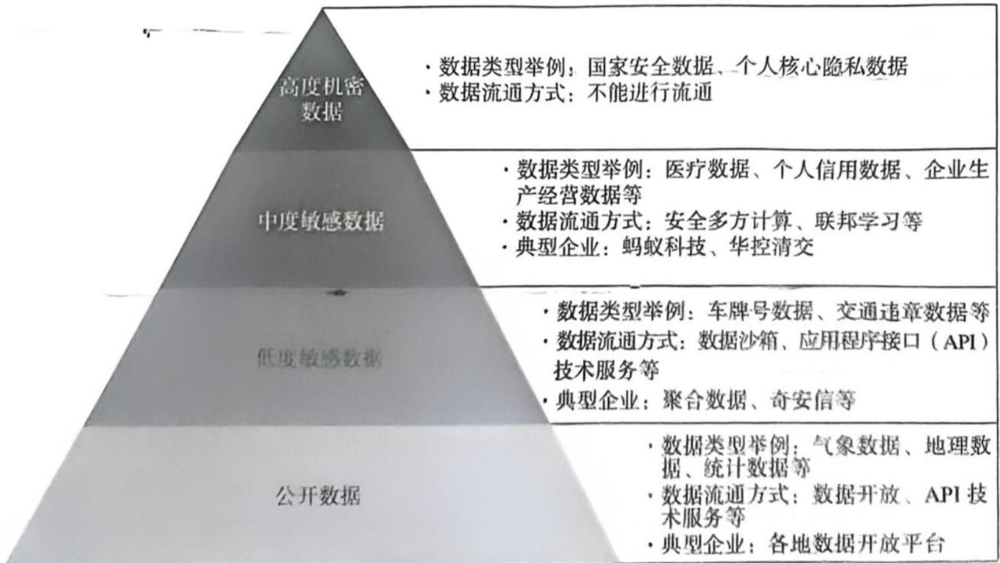
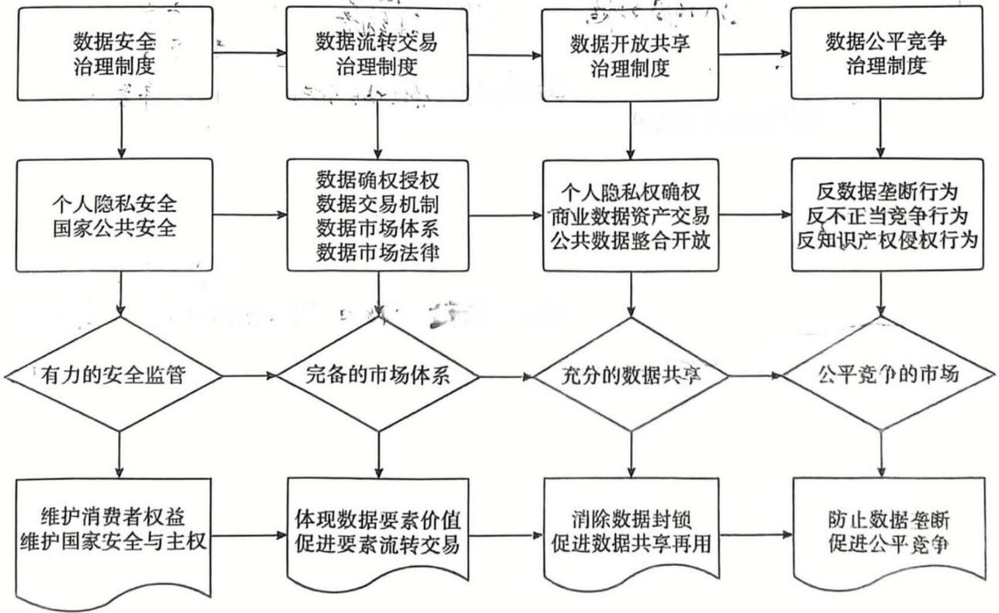

# 数据要素

# 章前导语

随着数字经济的发展，经济活动日益数字化，企业的生产经营活动日益建立在数据的基础上。在数字经济时代，数据已经成为企业在组织生产、智能决策、精准营销等环节中不可缺少的要素。英国《经济学人》杂志指出，在数字经济时代，数据已取代石油成为最有价值的资源。在数字经济中，不仅消费者的在线活动会产生大量的个人数据，而且随着物联网的发展，很多企业的生产经营活动也会产生大量的非个人数据（又称机器产生的数据）。作为一种新型生产要素，数据要素具有明显不同于传统生产要素的经济属性和价值实现方式，并且数据的采集、开发和利用还涉及个人隐私、数据安全等诸多监管问题，因此如何在确保个人隐私和数据安全的基础上，构建有利于最大限度释放数据要素价值的体制机制，就成为数字经济学要研究的重要问题。

# 学习目标

掌握数据的概念界定及其经济属性；

掌握数据要素促进经济增长的路径；

掌握数据产权与数据要素市场；

掌握数据开发利用的治理政策。

# 2.1 数据及其经济属性

# 2.1.1 数据的概念界定

# (1) 数据。

数据是数字经济的关键投入要素。目前关于数据的概念界定尚不统一，具有代表性的概念界定包括以下几类：一是技术角度的界定，如计算机科学将数据定义为“对所有输入计算机并被计算机识别、存储和处理的符号的总称”。二是价值角度的界定，强调数据的信息价值，如国际数据管理协会（Data Management Association，DAMA）给出的定义为：“数据是以文字、数字、图形、图像、声音和视频等格式对事实进行的表现。”国际标准化组织（International Organization of Standardization，ISO）将数据定义为“对事实、概念或指令的一种特殊表达形式”。我们认为，数字经济中的数据是任何反映事实、行为或信息，并且能够以数字化的方式呈现或被加工处理的符号介质。

# (2）大数据。

在数字经济中，成为关键要素的是大数据而非单个数据，大数据才是数字经济最重要的资源。大数据通常被理解为使用大规模计算能力和技术先进的软件进行收集、处理和分析的以大量、快速、多样和有价值为特征的数据。OECD 2016 年指出：“大数据通常被理解为使用大规模计算能力和高级技术性软件来收集、处理和分析具有大容量、高速率、多样性和价值性特征的数据。”

一般认为，大数据主要具有四个典型特征，即规模性（Volume）、多样性（Variety）、高速性（Velocity）和真实性（Veracity），简称“4V”特征。具体来说：规模性是指数据数量要足够大，只有足够数量的数据才会构成有用的数据资源；多样性是指数据反映的信息应该在多个维度上具有互补性，从而使相关人员能够依据这些数据做出更为精准的分析；高速性是指数据需要实时采集并加工处理，采集和处理的速度越快，则数据带来的价值越高；真实性是指数据质量和精确性应该是可以信赖的，这要求数据来源、数据采集和数据处理可信。

# 2.1.2 数据的类型

# （1）依据数据形式划分。

①结构化数据。结构化数据是由二维逻辑表来表达和实现的数据，严格地遵循数据格式与长度规范，主要通过关系型数据库进行存储和管理。  
②非结构化数据。非结构化数据是数据结构不规则或不完整，没有预定义的数据模型，不方便用数据库二维逻辑表来表达和实现的数据。它包括各种格式的办公文档、文本、图片、XML、HTML、各类报表、图像和音频/视频信息等。

# (2）依据数据持有者划分。

①个人数据。个人数据是指任何与一个已经被识别或能够被识别的自然人有关的数据信息，即任何可以直接或间接识别一个特定人的信息，既包括单个信息，也包括收集在一

起从而能够识别特定人的汇总信息。传统上，最常见的个人信息包括个人的姓名、家庭住址、身份证号码、电话号码、定位数据、网络标识等信息。

②商业数据。商业数据是商业企业在创新过程（研发、测试）或商业经营（营销、财务、售后服务等）中产生的数据。这些数据既可能是企业内部的数据，如关于企业身份的数据、企业的生产经营数据、企业的商业秘密等，也可能是企业外部的数据，如企业为了提供服务安装到其他企业所购设备上用来监控设备使用情况所产生的数据，以及对从外部采集的数据进行加工后所得到的数据。企业数据对促进企业的创新和高效率经营具有重要的积极意义，是企业重要的资产。

③公共数据。公共数据是指政府机构在提供公共服务的过程中所采集的各种数据，如经济统计、卫生健康、社会保障、交通管理、空间规划、气象环境等相关数据，政府财政支持的公共研发或学术活动所产生的数据。公共数据对促进社会创新和知识共享具有重要的作用，同时也对促进公共健康和安全，以及提高公共治理能力具有重要的作用。

# 2.1.3 数据要素的经济属性

尽管数据被称为数字经济时代的“石油”，但与石油等实物资源不同，数据具有相对独特的经济属性，具体来说：

# （1）数据具有非竞争性和相对排他性。

数据的最独特之处在于其具有突出的非竞争性，即同一数据可以被多个主体同时使用，且多个主体使用同一数据不会降低其他人使用该数据的价值。非竞争性意味着，数据开放共享不仅不会引起数据使用价值的下降，反而会提高数据开发利用的总价值，创造更大的社会价值。因此，数据的非竞争性内在地决定了数据可以同时被多人重复再用。另外，数据具有相对排他性。原始数据和非个人数据往往并不具有排他性。数据作为一种资源要素，任何企业都可以进行采集和开发利用，一个企业对其进行采集和开发利用并不会排斥其他企业对该数据的采集和开发利用。但是，涉及个人隐私的个人敏感数据信息或企业分析处理后的商业数据则具有一定的排他性，此时数据的排他性往往是人为的结果。数据的相对排他性要求设计差别化的数据治理政策。

# (2）数据具有广泛存在性、零边际成本和较强的替代性。

与石油等实物资源不同，数据信息是广泛存在并且可以低成本获取的。数据是人类活动的副产品。网络空间每时每刻都在产生大量的数据信息，并且随着用户数量和使用频率的增加，数据量会持续增长。借助各种人工智能技术，这些消费者数据能够被数字商务企业以较低的成本及时收集、存储和传输，同时，再利用数字化数据的边际成本近乎为零。因此，对于广泛存在的数据资源，很多企业都可以以非常低的成本进行采集、处理和应用。同时，不同的数据处理者通过不同渠道获取的数据或对不同类型数据的采集、处理和分析可以提供相同的信息，即数据之间具有较强的替代性。

# (3) 数据价值具有时间性。

数据具有生命周期，新数据和老数据往往具有不同的价值。随着时间的变化，数据往往会迅速贬值。因此，对于任何企业来说，仅仅占有大量数据而不及时对其加以开发利用，则数据会迅速贬值。因此，一个企业只有获取大量的即时数据并快速高效地对数据进行分析和利用，才能借助数据创造价值和增强竞争优势。

（4）数据的开发利用具有显著的正外部性。

对于单个消费者来说，其个人数据并不具有现实的经济价值，只有汇集了多个个人的数据且达到一定规模的数据集才有价值。同时，由于数据本质上是一种信息，而信息的最大特征是具有显著的外溢性，因此，一个企业对数据集进行分析并发现新的信息知识，会对其他企业的数据开发和信息知识获取产生正外部性。数据开发利用的正外部性意味着，数据开发利用往往会同时产生私人价值和社会公共价值，具有正外部性的数据开发利用会实现私人利益和公共利益的兼容。但数据的正外部性及“搭便车”问题的存在，也会导致数据占有人往往缺乏将数据开放共享的动力。另外，对个人数据来说，尽管其采集利用会有利于数据采集利用者，但是过度采集利用可能会侵犯消费者隐私，产生负外部性问题。

# 2.1.4 数据的价值实现过程：数据价值链

数据的价值实现过程可分为三个阶段，由此形成数据价值链（见图2-1）。第一阶段，数据资源阶段。原始数据是一种数据资源，在未被采集利用的情况下，原始数据仅具有潜在价值。第二阶段，数据资产形成阶段。当企业花费成本对原始数据进行采集、对数据进行结构化并汇总存储时，就形成了具有无形资产价值的数据库，并构成有价值的企业数据资产。第三阶段，数据价值创造阶段。数据持有企业可以直接在数据市场出售数据产品或服务来直接实现数据的货币化，或者基于数据挖掘获得的信息和知识来进行数据驱动的商业创新，从而间接实现数据的货币化。显然，随着对原始数据的采集、分析、决策、应用流程的深入，数据的价值也大幅提升。

  
图2-1 数据价值链

通常来说，仅仅拥有大数据并不会给企业带来价值和竞争优势，只有在企业具备较强的数据分析能力，能将大数据转化为信息知识并据此制定科学的商业决策时，大数据才会产生价值，即数据只有经过分析并转化为“数字智能”才会创造商业价值。因此，大数据分析能力是实现数据商业价值和决定数据企业竞争优势的核心能力，人工智能技术开发应用能力从根本上决定了数据要素的价值挖掘程度。数据价值链是一种数据开发利用和价值提升的流程，数据商业价值的最终实现主要取决于数字产品或服务的商业模式创新。因此，基于大数据的技术创新和商业模式创新是实现数据商业价值的关键。

# 2.2 数据促进经济增长的路径

# 2.2.1 数据要素促进经济高质量发展的内生机制

古典经济学家亚当·斯密提出，劳动分工是经济增长的根本动力。大卫·李嘉图提出的比较优势理论则强调资源禀赋对经济增长的重要意义，并且他还做出了资本报酬递减会导致经济增长停滞的预测。以索洛-斯旺模型为开端的新古典增长理论将经济增长看作一种要素投入产出的生产函数关系。新古典增长理论重点分析了劳动和资本要素对经济增长的外生推动作用，其重要的理论预测是：由于生产要素规模收益递减规律的存在，因此单纯的劳动和资本要素投入数量增长并不能维持可持续的经济增长，在缺乏技术进步的情况下，经济增长最终将停滞。显然，在新古典经济增长理论中，由于土地、劳动、资本等要素的数量增长受供给侧规模收益递减规律和需求侧单个产品需求增长有限性的约束，要素投入数量增长无法实现可持续的经济增长。现代内生增长理论更强调知识、人力资本、技术创新，认为这些要素是决定长期经济增长的关键，但是它仍然没有摆脱生产要素规模收益递减规律对增长的束缚。

在数字经济中，从整个数字经济生态来看，数据要素的开发利用呈现显著的规模收益递增特性。由于数据要素具有非竞争性、零边际成本且其开发利用具有正外部性，因此包含数据要素的数字经济增长函数将呈现出规模收益递增的增长促进效应。摆脱了生产要素规模收益递减规律对增长的限制，总产出的增长幅度将明显超出要素投入的增长幅度。首先，由于数据要素的使用具有非竞争性，因此数据要素的开发利用就不受生产要素规模收益递减规律的约束，可以直接促进经济高质量发展。其次，数据要素的开发利用过程不再是自然资源、土地、资本等物质资源要素的消耗过程。数据要素的开发利用过程本质上是一个不断产生信息知识的过程，以人工智能为基础的大数据的开发利用可以更高效地生产知识、产出更高质量的知识、更广泛地扩散和分享知识，从而内生地促进经济高质量发展。最后，数据的非竞争性和大数据技术所具有的“通用目的技术”特征，可以实现数据要素与其他生产要素的深度融合，使与数据要素整合在一起的全要素实现规模收益递增，促进全要素生产率的提升。

在数字经济背景下，数据要素的开发利用具有典型的供给侧规模经济效应和需求侧规模经济效应协同的特征，供给侧规模经济效应和需求侧规模经济效应具有内生的正反馈机制，大幅地向外移动了社会生产可能性边界，实现了经济增长的倍增效应，在数字经济中，数据要素的开发利用具有显著的规模经济效应和范围经济效应，即更大数量和更多样化的数据供给成本更低。数字商务企业基于大数据深度挖掘分析进行商业创新，从而为消费者提供个性化产品和服务，同时消费者以更低的搜寻成本和交易成本进行交易，并享受更契合需求的产品、更好的服务和更具竞争力的价格。这全面提升了消费者的消费体验，从而扩大了消费需求。特别是数字经济中存在的交叉网络外部效应使供给和需求相互强化，形成正反馈机制；更低成本的供给引致更大的消费需求，更大的消费需求则引致更高效的供给。数字经济供给侧规模经济效应和需求侧规模经济效应的双向正反馈机制摆脱了传统经济增长面临的生产要素规模收益递减规律和单个产品需求增长上限的约束，实现了内生的经济增长倍增效应。

# 2.2.2 数据要素促进经济高质量发展的实现路径

数据要素促进经济高质量发展主要是通过促进企业更好地决策、提升市场机制的有效性、与其他要素结合产生效率整合效应、驱动高效率创新以及优化公共服务供给与社会治理等路径实现的。

# （1）促进企业更好地决策。

现实的经济活动充满了各种不确定性，并且随着市场的扩展和企业生产规模的扩大，这种不确定性会给企业带来非常高的决策成本。这也是产生规模收益递减的重要原因之一，即随着规模的扩大，企业对未来预测失误会产生更大的利润损失。不确定性是影响市场实现资源优化配置的重要因素，并且长期以来受到经济学研究的忽视。企业的生产活动不仅受到要素投入的影响，同时也受到不确定性的影响。此时，信息具有重要的经济价值，拥有信息的企业大概率会获得更高的利润。数据本质上是过去的经济活动所产生的信息，对数据要素的开发利用可以帮助企业更好地预测未来的经济活动。大数据和人工智能技术的结合可以产生更多更有用的信息，从而帮助企业做出更科学、准确的预测，降低其所面临的不确定性，提高决策的精确性，减少由不确定性造成的决策失误及因此产生的损失。在企业决策失误概率大幅度降低后，其获得的利润也将大幅提升。

# 2 提升市场机制的有效性。

信息经济学理论研究表明，信息是影响资源优化配置的重要因素。当市场运行存在信息成本时，市场将无法实现最佳的资源配置。信息不完全和信息不对称会产生较高的搜寻成本和交易成本，特别是逆向选择和道德风险会严重影响市场实现资源优化配置。解决信息不对称问题的主要途径是为信息收集和信息披露提供有效的激励，为此人类设计了各种激励机制或通过行动来促进信息披露；但是由于激励成本和信息成本的约束，市场自身无法实现完全信息的效率状态。对数据的采集利用能够降低市场交易双方之间的信息不对称程度，大幅减少市场交易中的逆向选择和道德风险，从而提高市场主体之间的信任度，大幅降低信息不对称情况下机会主义行为所产生的高交易成本，提高市场交易的有效性。另外，信息缺乏会使消费者在参与市场交易时不得不支付较高的搜寻成本，从而降低了市场运行的效率。搜寻成本就是消费者寻找信息的成本。不完全信息下的消费者搜寻成本降低了不同品牌间的有效替代程度，从而产生垄断这一非效率结果。数据要素的开发利用会大幅降低经济主体的搜寻成本，扩大信息搜索范围并提高搜索结果的准确性，同时企业基于大数据和人工智能算法实施的针对特定消费者的精准个性化信息推广，会使市场交易者的搜寻成本大幅降低，实现更好的供需匹配。因此，对数据要素的开发利用会提高市场运行的有效性，提高整个经济的效率。

# (3）与其他要素结合产生效率整合效应。

大数据与其他要素结合会产生非常大的效率整合效应。对数据要素的开发利用会对其他要素的使用产生正外部性。大数据技术的应用可以实现传统资本、劳动等有形要素的新组合。数据作为一种要素投入，其本身并不会直接产生价值，只有在与资本、劳动等生产要素结合时，其才会借助这些要素创造价值。资本、劳动等要素也只有在与更高质量的数据信息结合时，才会创造出更高的价值，数据与其他有形要素结合的过程是一个经济数字化的过程，其本质是传统生产要素实现了更高效率的新组合。因此，数据信息与其他生产

要素的融合越全面、深入，其对总产出增长的贡献就越大。由于数据的基础性作用是信息性的，并且其只有与其他生产要素有效结合才能促进增长，因此，大数据只有与整个经济深度融合应用才会极大地促进经济高质量发展。

# （4）驱动高效率创新。

通过人工智能的深度学习，可以不断优化算法决策，实现数据驱动的创新。首先，以机器学习为核心的人工智能不仅是一种技术发明成果，也是一种引发更多发明创新的发明方法或发明工具。它重构了知识的生产过程，加快了研究发明的速度，提高了研究发明的生产率。其次，大数据及人工智能技术本质上是一种通用目的技术，具有巨大的外部性，可以被很多行业和领域普遍应用，并引发多行业、多领域的后续创新；从而全面提升全社会的生产效率，促进整个经济社会的整体变革和经济长期的高质量增长。综上，在数字经济中，新兴的数字产业化行业的创新发展、传统产业的数字化转型发展，以及数据驱动的创新，可以极大地释放整个经济的增长潜能，优化整个社会资源配置，不断提高全要素生产率。大数据及人工智能技术的普及以及其引发的持续的交互创新是实现经济可持续增长的根本动力源泉。

# (5) 优化公共服务供给与社会治理。

良好的公共服务供给与社会治理是经济高质量发展的重要制度保障，也是实现社会福利最大化的基础。在数字社会中，数据成为实现良好社会治理的重要促进因素，消除了传统公共管理中由信息不完全和信息不对称所带来的公共行政成本，并大幅降低了社会治理成本。首先，大数据的应用促进了政府更好地制定和实施公共政策。大数据使政府能更好地监测各种影响或威胁社会安全和稳定的因素，识别社会运行中的潜在风险，从而提前谋划应对措施，做到防患于未然；大数据为政府提供了更多有效的政策实施工具，使政府得以保持对政策实施的实时监督，从而灵活应对公共政策实施中的各种问题。其次，大数据会提升政府行政行为的透明度。数字政府和数字治理的建设可以促进政府与公民的沟通协调，实现更有效的多元公共治理。最后，大数据可以促使政府向社会提供更好的公共服务，如提供更好的医疗服务、保护环境、维护公共安全、应对重大公共卫生事件和实施重大灾害救助等，从而保障和提高公共福利。

# 2.2.3 释放数据要素促进增长的潜能的基础制度

为充分释放数据要素促进经济高质量发展的潜能，目前国家正在构建有利于数据价值释放的基础制度。2020年4月中共中央、国务院发布的《关于构建更加完善的要素市场化配置体制机制的建议》明确提出，通过培育数据要素市场，充分挖掘数据要素价值。2020年5月发布的《关于新时代加快完善社会主义市场经济体制的意见》则进一步提出了数据权属界定，完善了数据开放共享、交易流通的标准和措施。2022年12月中共中央、国务院发布的“数据二十条”对数据要素基础制度的四个模块，即数据产权制度、数据要素流通和交易制度、数据要素收益分配制度、数据要素治理制度提出了系统的政策思路（见图2-2），以更好地促进数据要素价值的释放。

  
图2-2 数据要素基础制度的四个模块

# 2.3 数据产权与数据要素市场

# 2.3.1 数据要素产权界定

# （1）非竞争性数据产权配置与科斯定理的适用性。

产权也称所有权，是包含多种权利的权利束，包括占有权、使用权、处分权、收益权等，其中排他性占有权是产权的根本权利。政府授予特定主体产权的根本目的是实现经济激励，即通过产权对投资或进行创造性活动的主体给予货币激励。

罗纳德·哈里·科斯（Ronald H. Coase）1960年的分析指出，产权界定是市场交易的前提，只有商品的产权被合理界定和受到保护，在产权可以转让和交易成本为零的情况下，一个竞争性的市场才会实现资源最优配置的结果。科斯定理实际上是将产权界定看作商品交易谈判的前提，其更强调在交易流转中实现商品价值最大化和相关利益主体的激励相容。根据科斯定理，对于竞争性商品来说，由于商品或要素的消费或使用具有竞争性，通过市场机制将其配置给对其评价最高的人来使用将会使社会总福利最大化。为了实现最优资源配置，竞争性商品的生产商应该被授予排他性产权。显然，根据科斯定理，竞争性使用的商品应该由对要素进行最大化开发利用的人使用，产权界定基础上的市场交易机制可以实现对资源的最优配置和租金的最优分配。因此，对竞争性私人产品来说，在市场机制下，明确界定的产权会实现资产的最佳使用和社会资源的最优配置，从而实现社会福利最大化。

从经济学意义上来说，任何一种有效的制度安排都应该有助于提升经济效率 产权制度设计的根本目的是实现资源的最优配置和最有效率的开发利用，违背这一目的的产权制度一定不是好的产权制度。由于数据具有非竞争性使用的特征，因此在数字经济背景下，适用于具有竞争性和排他性特征的私人产品的科斯定理不再充分有效。在资产或产品具有非竞争性时，仅仅将资产的排他性使用权赋予价值最大的那个主体并不会实现社会总福利

最大化。由于数据对很多主体都具有价值，且对于非竞争性数据来说，更多主体使用同一数据并不会增加成本，而是会创造更多的价值，因此让每个通过使用数据创造价值的主体都能以相同或相近的成本来接入和使用数据，会实现社会总福利的最大化。

我们通过一个假设的数值案例来加以说明。假设存在一种经济物品A，该物品的潜在使用者共有10个企业，即企业1至企业10。这些企业使用该物品创造的潜在价值分别为10，9，8，…，1。为简化分析，假设该物品开发利用的成本为0。经济物品A的所有者和潜在使用者之间的交易通过市场谈判确定的竞争性出价来实现。

情况1：经济物品A为竞争性私人产品。假设该物品所有者拥有对该物品的排他性产权。由于竞争性私人产品的市场交易会遵循“价高者得”的规则，因此通过市场交易，该物品一定会被潜在创造最大价值的企业1获得。根据标准的对等谈判双寡头博弈的纳什均衡解，在产权明晰的情况下，该物品所有者和企业1之间的剩余分配为（5，5）。此时，市场交易的社会总剩余为10，等于该物品的所有者剩余加上企业1（生产者）剩余。对于社会计划者来说，社会总福利最大化的社会总剩余也为10。因此，这种产权制度安排及其效率结果是符合资源最优配置目标的，这是科斯定理的结果。

情况2：经济物品A为非竞争性产品。这意味着，一个企业使用该物品的价值并不会因为其他企业同时使用该物品而下降。此时，如果采用科斯的产权界定逻辑，则产权明晰情况下市场交易的“价高者得”规则会使该资产的排他性使用权被企业1-获得。此时，该物品的所有者剩余加上企业1剩余，即社会总剩余为10。对于社会计划者来说，实现社会福利最大化要求充分挖掘非竞争性数据资源的潜力，让同一数据为更多企业所使用。因此，在开放共享情况下，实现社会福利最大化的总剩余为10个企业同时使用经济物品的总剩余，即为55。通过对比可以发现，此时的社会总福利远远大于科斯的产权界定逻辑下的社会总福利，绝对产权逻辑会造成非竞争性产品有45的潜在价值无法实现，因此存在非竞争性产品利用不足的问题。

表2-1总结了科斯的产权界定逻辑下情况1和情况2的产权配置结果。

表 2-1 科斯的产权界定逻辑下竞争性产品（情况 1）与非竞争性产品（情况 2）的产权配置结果  

<table><tr><td>产品性质</td><td>物品所有者剩余</td><td>企业剩余</td><td>市场均衡条件下的 社会总福利</td><td>对于社会计划者 来说的社会总福利</td></tr><tr><td>竞争性产品</td><td>5</td><td>5</td><td>10</td><td>10</td></tr><tr><td>非竞争性产品</td><td>5</td><td>5</td><td>10</td><td>55</td></tr></table>

因此，对于非竞争性产品，仅仅赋予创造价值最大的使用者排他性权利并不是最优解。非竞争性产品应该让更多所有者使用，因为额外使用所带来的边际收益远高于零边际成本，更多所有者使用和消费会创造更大的社会总价值。赋予非竞争性数据要素的所有者排他性产权，会使数据要素仅被创造价值最大的那个所有者使用，这排除了更多所有者重复再用同一数据要素的可能性，因而不利于数据要素实现最大价值。因此，不应该原封不动地将传统的产权理论运用到数据产权界定中，这是因为数据要素具有很多与传统要素明显不同的特征，如非竞争性？因此，我们不能将适用于竞争性私人产品的产权界定逻辑应用于作为非竞争性产品的数据要素。

(2）大数据多元主体下排他性产权的“反公地悲剧”效应。

根据法经济学的观点，产权制度的创立是为了促进人与人之间达成帕累托改进的谈判合作解。因此，在合作创造价值的经济活动中，产权制度的设立是为了促进不同主体之间的合作，消除私人主体之间的合作障碍，最大限度地实现资源要素的价值。从这个意义上来说，产权制度设计不应该增加私人主体之间的合作障碍，也不应该提高合作达成交易的成本，否则会阻碍实现资源要素价值最大化的合作解的达成。

科斯定理有一个重要的前提假设，即市场谈判的交易成本为零。在数字经济背景下，数据与传统劳动、资本等实物要素的一个重要的不同是：单个原始数据是没有价值的，只有很多数据集中在一起达到一定规模和维度，即构成大数据才具有商业开发的价值，因此数据之间是互补的，大数据具有整合效应。在大数据涉及主体众多的情况下，如果为了保护消费者隐私而赋予其个人数据所有权，那么数据企业要采集、利用和交易个人数据就必须与每个消费者进行谈判。而由于个人隐私数据的交易价格受到个人对隐私价值偏好的差异、使用者的数据使用范围、双方掌握信息的多寡和市场结构等因素的影响，所以个人隐私信息交易较难达成统一的市场均衡价格，而更多是个人化定价，由此也会产生非常高的谈判交易成本。由于任何一个数据主体的决策都会对其他主体产生外部性，因此每个数据主体的利益最大化决策都会产生数据要素利用的“反公地悲剧”问题，即很多人对资源拥有排他性产权，但任何人都不具有使用资源的优先权，从而导致资源利用不足的问题。

为了进一步解释，我们假设此时市场当中有  $n$  个消费者，即有  $n$  个原始数据所有者，有  $m$  个数据企业，它们为获得原始数据需要与每个消费者进行一对一谈判，则市场当中总的谈判次数为  $mn$  。假设交易谈判的单位交易费用为  $t$  。在原始数据市场交易谈判中，假设最终的成交单价为  $P$  。这一价格实际包含了数据企业使用消费者数据给单个消费者所带来的负外部性  $\alpha$ ，成交后的消费者净剩余即为  $P - \alpha$  。在单位交易费用  $t$  为0的情况下，涉及  $n$  个原始数据所有者的大数据接入谈判并不会扭曲资源最优配置，反而会实现隐私保护和数据利用的平衡。当单位交易费用  $t > 0$  时，单个企业的交易净收益为  $R - nP - nt$  （其中  $R$  为企业利用这些数据所获得的收益）。显然，在交易谈判中，如果单个消费者的要价  $P$  太高或总交易成本  $nt$  太高，则会导致  $R - nP - nt < 0$ ，此时单个企业就会选择退出市场（见表2-2）。

表 2-2 消费者拥有产权情况下的数据要素配置结果  

<table><tr><td>交易费用</td><td>单个消费者的收益</td><td>单个企业的交易净收益</td><td>要素配置结果</td></tr><tr><td>t=0</td><td>P-α</td><td>R-nP</td><td>利用充分</td></tr><tr><td>t&gt;0</td><td>P-α</td><td>R-nP-nI</td><td>利用不足</td></tr></table>

由于大数据的基本特征之一就是数量巨大，因此大数据会涉及数量巨大的数据所有者，这会导致数据企业在数据交易谈判中的总交易费用  $nt$  大幅提高；在企业数量为  $m$  的情况下，社会总交易费用为  $mnt$ ，数据所有者数量和企业数量的增长会导致社会总交易费用指数化增长，高交易费用反过来又会导致非竞争性的数据要素无法实现最大化利用。因此，在单个数据之间具有互补性和涉及众多数据主体的情况下，赋予众多原始数据主体对个人数据的排他性所有权会导致产权碎片化，产生资源利用不足的“反公地悲剧”问

题。在数据交易的一对一谈判过程中，大数据涉及的众多单个消费者的要价会大幅增加整个社会的要素利用成本，降低数据企业开发利用数据的回报，从而阻碍数字经济的创新发展。

上述分析结果说明，对于具有非竞争性特征的数据来说，赋予其所有者排他性产权不是保护个人数据的最佳方式，因为这会背离促进数据要素最大化利用的效率目标。

# (3）中国数据产权制度创新实践。

2022年12月，我国发布的“数据二十条”提出：探索建立数据产权制度，推动数据产权结构性分置和有序流通，结合数据要素特性强化高质量数据要素供给；在国家数据分类分级保护制度下，推进数据分类分级确权授权使用和市场化流通交易，健全数据要素权益保护制度，逐步形成具有中国特色的数据产权制度体系。“数据二十条”还提出，建立公共数据、企业数据、个人数据的分类分级确权授权制度，探索数据产权结构性分置制度。根据数据来源和数据生成特征，分别界定数据生产、流通、使用过程中各参与方享有的合法权利，建立数据资源持有权、数据加工使用权、数据产品经营权等分置的产权运行机制。建立保障权益、合规使用的数据产权制度。首先，推进实施公共数据确权授权机制。鼓励公共数据在保护个人隐私和确保公共安全的前提下，按照“原始数据不出域、数据可用不可见”的要求，以模型、核验等产品和服务等形式向社会提供，对不承载个人信息和不影响公共安全的公共数据，推动按用途加大供给使用范围。推动用于公共治理、公益事业的公共数据有条件无偿使用，探索用于产业发展、行业发展的公共数据有条件有偿使用。“其次，推动建立企业数据确权授权机制。对各类市场主体在生产经营活动中采集加工的不涉及个人信息和公共利益的数据，市场主体享有依法依规持有、使用、获取收益的权益，保障其投入的劳动和其他要素贡献获得合理回报，加强数据要素供给激励。最后，建立健全信息数据确权授权机制。对承载个人信息的数据，推动数据处理者按照个人授权范围依法依规采集、持有、托管和使用数据，规范对个人信息的处理活动，不得采取“一揽子授权”、强制同意等方式过度收集个人信息，促进个人信息合理利用。探索由受托者代表个人利益，监督市场主体对个人信息数据进行采集、加工、使用的机制。

# 2.3.2 数据要素市场

数据要素的市场化配置是释放数据要素价值和促进经济高质量发展的重要基础。国家工业信息安全发展研究中心将中国数据要素市场划分为数据采集、数据存储、数据加工、数据流通、数据分析、数据应用、生态保障七大模块，覆盖数据要素从产生到发生要素作用的全过程。① 当前，中国数据要素市场处于高速发展阶段。根据国家工业信息安全发展研究中心测算的数据，“十三五”期间，以数据采集、数据存储、数据加工、数据流通等环节为核心的数据要素市场增长尤为迅速。2020年，中国数据要素市场规模达到545亿元；“十三五”期间，市场规模复合增速超过  $30\%$  ；“十四五”期间，这一数值将突破1749亿元，整体进入高速发展阶段（见图2-3）。

总体来说，一个完备的数据要素市场体系包括以下几个重要的组成部分：

图2-3 2016—2025年中国数据要素市场规模（单位：亿元）  
  
资料来源：国家工业信息安全发展研究中心

# （1）分级分类的数据标的。

数据流通作为数据要素市场的核心环节，需要针对不同类型数据提出不同的解决方案。国家工业信息安全发展研究中心认为，需要针对不同类型数据分级分类进行数据要素市场化配置，并提出了数据流通金字塔模型。该模型将数据分为公开数据、低度敏感数据、中度敏感数据、高度机密数据四种，并针对不同数据类型，提出了不同的数据流通方式（见图2-4）。

图2-4 数据流通金字塔模型  
  
资料来源：国家工业信息安全发展研究中心

(2）分工合作的多元数据市场主体。

数据市场主体主要包括数据所有者、数据使用者、数据中介与第三方服务机构。数据所有者是数据的供给者，主要是数字商务企业，其采集大量关于用户的数据，并进行一定的处理，形成结构化的数据库。数据商务企业收集的大量用户数据并不局限于自己使用，有时会与第三方共享或出售给第三方，这些第三方也属于数据使用者。在数据市场运行中，数据中介发挥了重要的作用，其主要是从公共和私人渠道收集汇总各种不同的数据，协调数据供需双方的数据交易，同时也会提供一些增值服务，如对数据进行进一步加工处理以方便特定使用者使用的服务，如支付服务、信用查询服务等。数据中介在降低交易成本和克服数据市场交易障碍中发挥了重要的作用。第三方服务机构主要是为数据市场交易提供附属服务的机构，如数据价值评估机构、结算支付机构等。

(3) 等层次的数据要素交易市场体系。

数据要素市场分为一级市场和二级市场。一级市场是数据资源市场，主要对应数据资源化阶段，涉及大量的原始数据。一级市场着力解决数据要素的有效入场问题，关键是明晰权责和安全标准，明确数据加工使用权和经营权，遵守基本的隐私保护和网络数据安全要求，确保数据来源、质量、安全性等可靠。二级市场主要是资产化数据市场，针对的是企业对原始数据进行汇总编辑（数据结构化）而形成的数据库或数据产品。二级市场着力解决数据要素的高效流通问题，主要涉及数据交易、流通和应用，目的是实现数据要素的价值，从而促进数据要素的充分利用和数据驱动的创新。

（4）完备的数据市场交易规则体系。

完备的数据市场交易规则体系可以降低市场交易成本，并保障各参与方的合法权益，有利于数据要素市场有序运行和健康发展。数据市场交易规则主要包括：第一，数据市场准入规则。建立数据流通准入标准规则，强化市场主体数据全流程合规治理，确保流通数据来源合法、隐私保护到位、流通和交易规范。第二，数据标准体系。制定数据标准体系，具体包括数据格式标准、数据质量标准和数据接入安全标准，以实现数据接入、交易和使用的标准化，促进数据整合、接入和互操作。第三，数据价格机制。坚持市场机制的决定性作用，支持探索多样化、符合数据要素特性的定价模式和价格形成机制，推动用于数字化发展的公共数据按政府指导定价有偿使用，企业与个人信息数据市场自主定价，从而形成有利于数据要素市场化配置的价格机制，并根据数据要素的特点来建立科学的数据资产评估机制和资产定价规则。第四，数据交易治理规则。数据市场健康运行需要有公平交易的市场环境，在这种环境下，各种违背公平交易的不正当竞争行为和垄断行为都会得到抑制，从而确保市场交易秩序；同时，数据市场健康运行还需要有一定的安全规则，要在数据安全的基础上进行交易。

# 2.4 数据开发利用的治理政策

# 2.4.1 数据采集利用中的市场失灵

（1）个人隐私泄露。

数据是数字经济时代最重要的资源。数字平台企业收集了大量多维度的关于在线用户的数据信息，并利用这些数据信息实施价格歧视、投放个性化广告或由第三方接入数据进

行商业开发。数字平台企业的这些活动在降低消费者搜寻成本和提升消费者消费体验的同时，也产生了企业过度采集消费者数据、超范围使用消费者数据、对消费者的敏感数据信息保护不力等问题，使消费者面临个人隐私数据泄露的风险，引发了公众对个人隐私数据安全的担忧，从而影响了数据的采集利用效率。

# (2）网络数据安全风险。

随着互联网和大数据的普及，企业的商业活动、个人的交易活动和社会活动日益网络化、数字化，但黑客攻击、数据泄密、网络诈骗等数据安全风险也日益上升。数据安全不仅事关国家经济社会发展和社会稳定，也事关国家主权和国家安全。数据安全的内涵主要包括两方面：一是数据本身的安全，主要是指运用云计算、现代密码技术等对数据信息进行主动保护，确保数据的完整性、机密性等；二是数据防护安全，主要是指运用现代大数据存储技术对数据信息进行主动防护，确保数据系统的弹性和复原力等。总而言之，数据安全的实质是主动保护或防护数据信息资源免受威胁、干扰和破坏，即保证数据信息的安全。

# (3) 数据市场垄断。

谷歌、亚马逊、脸书、阿里、腾讯、美团、滴滴等大型数字企业以数据开发利用为主要业务，而数据开发利用具有显著的规模经济效应和范围经济效应，因此这些企业可以利用数据的规模经济效应和范围经济效应形成自身的竞争优势，此时数据开发利用本身会形成较高的进入壁垒，从而出现基于数据的市场势力。从经济效率的角度来说，大型数字企业拥有基于数据的市场势力有利于其对数据要素的采集和开发利用，但是由于大型数字平台基于数据的市场势力具有稳固性，因此其可能会实施自我优待、捆绑搭售、个性化定价、过度采集消费者数据等数据滥用行为。特别是在数据交易过程中，在数据方面具有垄断地位的企业可能会实施封锁数据、设置不合理的数据交易条款、进行歧视性数据接入等数据垄断行为，严重影响数据要素的自由流通。

# （4）数据市场化配置体制机制不完善。

数据市场是一个复杂的系统，需要长期培育才能发展起来。作为一种具有独特经济属性的新型生产要素，数据要素的市场化配置体制机制还在发育中，由于某些障碍导致市场交易机制失灵，因而市场无法实现资源最优配置。目前，中国数据市场化配置体制机制不完善主要体现在以下几个方面：一是数据市场体系下完备。比如，数字市场缺乏交易中介和第三方服务机构等市场主体，场内交易与场外交易没有实现良性互补的协同发展，全国统一的数据要素市场尚未形成，地区和行业分割问题突出。二是数据市场运行仍然面临很多交易制度障碍，如数据资产价值评估准则不明、数据交易缺乏标准化合约、数据要素的质量标准缺失等。三是数据要素交易价格机制尚未形成。由于数据要素的多形态性和数据价值在不同场景下的巨大差异性，市场较难形成统一的定价机制。为进一步完善数据要素的市场化配置，需要发挥市场机制的决定性作用，完善相关制度，从而最大限度地释放数据要素促进经济高质量发展的潜能。

# 2.4.2 建立有效的数据治理体系

数据治理是指政府、企业、行业、社会、个人等多元主体为确保数据安全、有序、自由地流转交易和共享再用所采取的技术、法律、经济、行政等多种措施的系统性治理活

动。国际上通行的数据治理概念主要是指企业自身为确保数据安全、数据质量等所采取的管理行动，即数据治理是微观主体的数据管理行为。在中国数字经济理论和政策中，数据治理不仅包括企业的数据管理活动、更强调政府为促进数据的安全、有序开发利用所采取的相关政策及建立的制度体系，数据治理的目标是确保数据以可信、安全、高效和公平的方式进行流转交易和共享再用，以更好地发挥市场的基础性作用，从而最大限度地发挥市场数据要素促进经济高质量发展的潜能。据此，数据治理体系应主要由四部分构成（见图2-5）。

一是数据安全治理制度。针对数据开发利用产生的各种安全风险，数据安全治理制度的重点是保护个人隐私数据和维护国家数据安全，确保数据采集、利用和流转不侵犯个人隐私，并且有助于提升国家公共安全水平。

二是数据流转交易治理制度。针对数据是数字经济中最有价值的生产要素以及中国数据要素价值释放不充分问题，数据流转交易治理制度的重点是培育并完善数据要素市场体系和市场交易治理制度促进数据要素依据市场规则有序流转交易，更好地发挥市场机制在促进数据要素优化配置中的决定性作用。

三是数据开放共享治理制度。针对个人数据、商业数据、公共数据在采集、开发和共享再用过程中存在的各种体制机制障碍，数据开放共享治理制度的重点是设计分类施策的数据开放共享机制，促进数据重复再用，鼓励数据驱动的创新，发挥数据要素的乘数效应，最大限度地释放数据价值。

四是数据公平竞争治理制度。针对大型平台垄断数据并实施各种严重妨碍市场竞争的数据垄断行为、不正当竞争行为和数字版权侵权行为的现实情况，数据公平竞争治理制度的重点是设计科学的数据市场秩序监管政策，维护公平竞争的市场秩序。

  
图2-5 数据治理体系

# 本章小结

数据具有相对独特的经济属性。具体来说，数据具有非竞争性和相对排他性；数据具有广泛存在性和零边际成本；数据价值具有时间性；数据开发利用具有显著的正外部性。

数据要素会极大地促进经济高质量发展，主要路径包括：促进企业更好地决策；提升市场机制的有效性；与其他要素结合产生效率整合效应；驱动高效率创新；优化公共服务供给与社会治理。

由于数据要素具有非竞争性且大数据具有多元主体性，因此按照科斯定理赋予数据主体排他性产权会严重阻碍数据价值的最大化释放。数据产权制度应根据数据要素的经济属性科学设计，以最大限度地发挥数据要素的增长促进效应。

数据要素的市场化配置是释放数据要素价值和促进经济高质量发展的重要基础。一个完备的数据要素市场体系包括分级分类的数据标的、分工合作的多元数据市场主体、多层次的数据要素交易市场体系、完备的数据市场交易规则体系。

由于数据采集利用会引发个人隐私泄露、网络数据安全风险、数据市场垄断、数据市场化配置体制机制不完善等市场失灵问题，因此需要建立有效的数据治理体系。数据治理体系主要包括：数据安全治理制度、数据流转交易治理制度、数据开放共享治理制度、数据公平竞争治理制度。

# 主要概念

数据 非竞争性 数据价值链 数据产权 数据市场 数据治理

# （复习题）

1. 数据要素具有哪些独特的经济属性？  
2. 数据要素促进经济高质量发展的路径有哪些？  
3. 为什么基于科斯定理的产权界定逻辑不适用于数据产权界定？  
4. 数据市场体系由哪些部分构成？  
5. 数据治理体系的目标与政策重点是什么？

# 推荐阅读文献

JONES C I, TONETTI C. "Nonrivalry in the Economics of Data." American Economic Review, 2020, 110 (9).

FARBOODI M, MIHET R, PHILIPPON T, et al. "Big Data and Firm Dynamics." American Economic Review, 2019 (109).

唐要家，唐春晖.“数据垄断”的反垄断监管政策.经济纵横，2022（5）.

唐要家，唐春晖.数据价值释放的理论逻辑、实现路径与治理体系.长白学刊，2022（1）.

店要家.数据产权的经济分析，社会科学辑刊，2021（1）.

唐要家，唐春晖.数据要素经济增长倍增机制及治理体系.人文杂志，2020（11）.