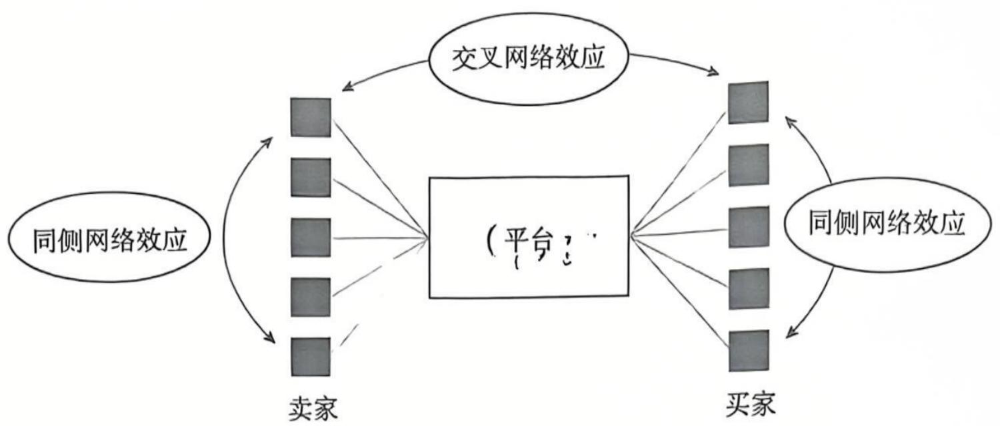
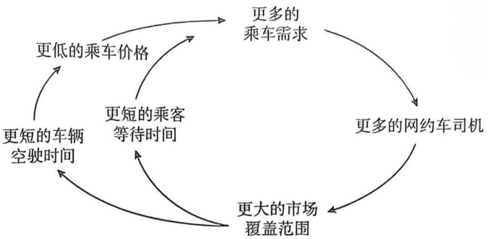
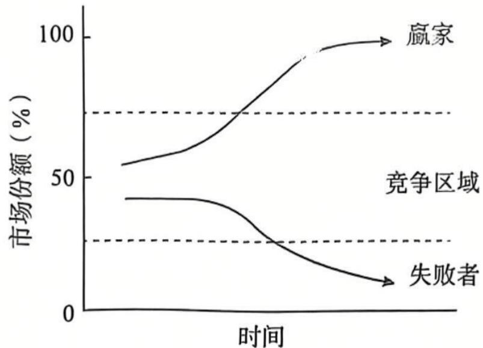
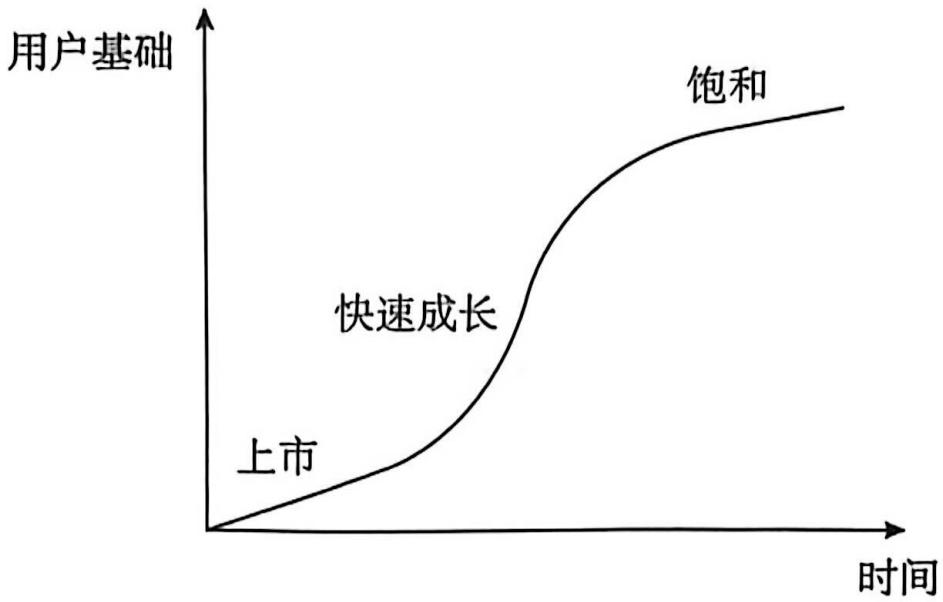

# 网络效应

# 章前导语

网络效应是数字经济的一个重要特征，也体现了数字经济最基本的运行规律。在现实生活中，对于淘宝、京东等购物平台以及微信等聊天平台而言，参与到网络中的人越多，就会吸引越多的人加入网络，从而提升网络平台的价值和每个参与者的效用。网络效应成为推动大型数字平台快速发展的最重要因素。同时，网络效应也是影响数字经济市场竞争的最重要因素。网络效应的正反馈机制会使强者越强、弱者越弱，从而产生“赢家通吃”的结果。在网络效应具有重要效率贡献但同时也会导致市场垄断的情况下，互联互通政策成为重要的平衡政策，由此也产生了应如何设计最优的互联互通政策的问题。总而言之，网络效应是数字经济的重要特征之一，学习网络效应理论有助于我们更好地理解数字经济中很多新的现象，并设计科学的互联互通政策。

# 学习目标

掌握网络效应的概念、本质及分类；

掌握交叉网络效应的含义与数字平台市场策略；

掌握网络效应对市场的影响；

掌握网络互联互通政策的经济分析。

# 4.1 网络效应概述

# 4.1.1 网络效应的概念及本质

# (1) 网络效应的概念。

当消费者使用某商品或服务所获得的效用与使用该商品或服务的其他用户的数量具有相关性时，此商品或服务即具有网络效应。网络效应又称网络外部性。在数字经济中，网络效应通常是正的。在存在网络效应的情况下，使用同种产品和服务的消费者越多，每个使用者从产品和服务消费中得到的效用就越大。例如，消费者使用微软的 Windows 操作系统获得的效用与 Windows 操作系统的用户规模直接相关，用户规模越大，用户之间传输文件就越便利，消费者使用该系统得到的满足感就越大；同时，与 Windows 操作系统兼容的软件和应用越多，就越能提升消费者使用 Windows 操作系统的满足感。

通常来说，消费者使用网络产品得到的效用来自两个方面：一是产品本身的价值。该价值由产品的内在属性决定，是即使没有其他使用者，消费者也可以从消费产品中得到的价值。二是网络的价值。该价值与用户规模有关，是消费者从与其他使用者的交互中得到的价值。如果用  $U_{ij}$  表示消费者  $i$  使用  $j$  网络得到的效用， $n_j^e$  代表网络的预期用户规模，则该效用可以表示为以下函数形式：

$$
U _ {i j} = a _ {i} + f _ {i} \left(n _ {j} ^ {e}\right) \tag {4.1}
$$

式（4.1）中， $a_{i}$  表示与网络无关的独立效用，它来自使用产品或服务的价值。 $f_{i}\left(n_{j}^{e}\right)$  代表网络效应，随着网络期望用户规模的增大而增加。网络效应体现了新加入网络或平台的消费者给其他消费者带来的额外效用，并且其他消费者无须为此支付额外的费用。

网络效应体现了梅特卡夫定律（Metcalf's Law）。梅特卡夫定律是一个关于网络价值与用户数量的关系的定律，其内容是：一个网络的价值等于该网络内联网用户数量的平方。如果用  $V$  表示网络的总价值，  $n$  表示该网络的用户数量，则  $V = n^2$  。该定律表明，一个网络的用户数量越多，整个网络和该网络内每个用户的效用就越大。例如，对于微信等社交媒体平台来说，单独一个人加入平台是没有价值的，但随着网络中用户数量的增加，每个用户可以与更多的人进行互动，此时网络价值就会大幅增加。

# (2）网络效应的本质。

网络效应本质上是网络规模扩大过程中产生的一种需求侧规模经济效应，即随着加入网络的用户数量的增加，所有用户的总效用会相应提高。

需求侧规模经济效应与供给侧规模经济效应的差异具体体现在以下两个方面：首先，供给侧规模经济效应是指通过生产规模扩大实现单位产品平均成本的下降，主要反映的是单位产品成本下降。需求侧规模经济效应强调通过大规模用户的消费或互动来促进所有用户价值的提升，主要反映的是单个消费者价值的提升。其次，需求侧规模经济效应具有更强的“经济性”。供给侧规模经济效应往往受到要素稀缺性或其他困难（如管理大组织的困难等）的限制，随着规模的持续扩大，将出现规模收益递减的情况。需求侧规模经济效

应摆脱了要素稀缺性的限制，其“经济性”具有更大的范围，其规模经济效应体现得更为明显。

需求侧规模经济效应是导致大型数字平台出现的重要因素，是数字经济时代的重要特征。它使得用户的边际收益随网络规模的扩大不断递增，市场中用户规模庞大的大型数字平台也因此具备了网络效应优势，整个市场呈现出“强者愈强”的发展态势。目前，市场上出现了苹果、微软、亚马逊、谷歌、脸书、阿里、腾讯、抖音等具有“守门人”地位的大型数字平台。

# 4.1.2 网络效应的分类

# （1）直接网络效应和间接网络效应。

根据网络效应产生的来源，可以将网络效应分为直接网络效应和间接网络效应两类。

直接网络效应是指使用同一产品的用户数量的增加会提高其他已有使用者效用的效应。在直接网络效应下，用户使用一种产品的价值与用户数量直接相关，使用某一产品的用户越多，则每个用户的效用就越大，该产品的价值就越高。例如，单个用户使用微信毫无价值，若其身边所有的同学、朋友、亲人等都使用微信，则微信的价值就很高。随着微信用户数量的增加，用户间的交流变得更加广泛和便利，每位用户可以从中获得的效用就增加了，这就产生了直接网络效应。

间接网络效应是指随着一种产品的用户数量的增加，由该产品的互补品数量增多、价格降低或质量提升所引起的用户效用提升的效应。在某些情况下，用户使用一种产品的效用取决于与该产品互补的产品的数量、价格和质量。一种产品的互补品数量越多、价格越低、质量越高，使用该产品的用户的效用就会越大。间接网络效应主要存在于由基础产品（硬件）与辅助产品（软件）构成的硬件/软件中。例如，随着计算机用户数量的增多，会有更多的厂家生产与计算机相关的软件，于是计算机用户可得到的软件数量增加、价格降低、质量提升，从而获得额外的效用，这就产生了间接网络效应。

# (2）同侧网络效应和交叉网络效应。

在数字平台双边市场中，根据网络效应的群体关系，可以将网络效应分为同侧网络效应和交叉网络效应两类。

同侧网络效应（Same-side Network Effect）是市场一侧用户对同侧用户产生的网络效应。同侧网络效应是一种直接网络效应，仅限单侧用户数量增多给同侧用户带来的效用。例如，更多的人加入社交媒体平台会给使用该平台的所有用户提供更多的交友选择或互动机会，从而提高了所有用户的效用。很多电子商务平台允许消费者之间相互交流信息，消费者的好评或交易量数据会为其他消费者提供购买参考，从而帮助消费者减少购买到不满意商品的机会，产生正外部性。

交叉网络效应（Cross-side Network Effect）是指汉边市场中一侧用户对另一侧用户产生的网络效应或外部性，即市场中一侧用户数量的增加会导致另一侧用户效用的提高。交叉网络效应体现为数字平台两侧用户之间的交互影响，也称跨侧网络效应。例如，电子商务平台上的卖家众多，可以为买家提供更多样化的商品选择和更具竞争力的商品报价，而众多的买家也为卖家提供了巨大的市场需求。图4-1展示了同侧网络效应与交叉网络效应的关系。

  
图4-1同侧网络效应与交叉网络效应的关系

# (3) 正向网络效应与负向网络效应。

根据网络效应的作用方向，可以将网络效应分为正向网络效应和负向网络效应两种类型。

当新增一个用户会提升所有用户的效用，即加入网络或平台的用户数量越多，就会吸引越多用户加入时，产生的就是正向网络效应。正向网络效应会促使企业快速增长，出现“强者愈强”的情况。

当网络或平台的用户数量越多，每个用户所获得的效用就越低，也就是说，网络的总价值随着用户数量的增加以低于线性速率的速率增长甚至负增长时，产生的就是负向网络效应。负向网络效应会使一个网络或平台迅速流失大量用户，乃至完全退出市场，出现“弱者愈弱”的情况。

# 4.2 交叉网络效应

# 4.2.1 交叉网络效应的含义

交叉网络效应主要出现在数字平台双边市场。在数字平台双边市场，交叉网络效应来源于数字平台两侧用户之间的互补性和相互依赖性。网约车平台的商业运营充分体现了平台两侧用户之间的正反馈机制。网约车平台上集聚了更多的司机和车辆，可以让乘客享受到更便利的乘车服务和更低的乘车价格，这会吸引更多的乘客乘坐网约车；而更多的乘客乘坐网约车反过来也可以让网约车司机获得更多的收入，从而吸引更多的网约车司机加入平台来提供网约车服务，进一步增加网约车的供给数量，使车辆空驶时间更短，乘车价格下降，进而引发更多的乘车需求（见图4-2）。

交叉网络效应是消费者决定是否加入某一平台时的重要考量因素。在存在交叉网络效应的情况下，一侧用户是否加入数字平台的决策主要取决于其对另一侧用户规模的预期。如果消费者预期另一侧用户规模较大，并且较大的另一侧用户规模会给该侧用户带来更高的效用，则该侧用户就会更愿意加入该数字平台。在数字平台两侧用户具有正向交叉网络效应的情况下，两侧用户之间相互吸引会产生正反馈机制，导致市场上出现“强者愈强”的趋势，即拥有较大用户规模的数字平台占有更大的市场份额，而用户规模较小的平台则无法获得持续的成长。

  
图4-2 网约车平台的正反馈机制

交叉网络效应是推动平台发展壮大的关键因素。淘宝在初创期采用免费政策并提供个性化、本土化服务，以吸引更多卖家入驻平台创业，产品或服务数量的持续增加吸引了更多买家，而买家数量的增加又吸引了更多的潜在卖家入驻平台，产生了强大的交叉网络效应。借助其强大的交叉网络效应，淘宝实现了市场份额的快速扩张，成为中国B2C市场的巨头之一。淘宝平台两侧用户具有显著的双向交叉网络效应，即平台任一侧的用户数量增长都会引起另一侧用户数量增长，两侧用户相互正强化。由于交叉网络效应在很大程

知识链接

  
交叉网络效应与平台估值的争论

度上决定了数字平台的成长性和市场地位，因此交叉网络效应成为影响企业市场价值的重要因素。

# 4.2.2 交叉网络效应与数字平台市场策略

在平台发展初期，如何让双方都参与进来是平台面临的关键问题。如果想说服买家加入某个平台，就必须先说服一部分卖家加入，并且使其相信一定会有买家参与市场，反之亦然。这就是所谓的“鸡蛋相生”问题。

由于数字平台两侧用户之间存在需求依存性以及交叉网络效应，因此平台可以通过灵活运用定价机制，最大限度地激发交叉网络效应，加速市场规模扩张。不平衡定价是平台企业普遍采用的价格策略，即平台根据自身的策略需求对两侧用户进行差别定价，并以从支付较高价格一方获得的收益来弥补支付较低价格一方的损失。如果一侧用户给另一侧用户带来了更大的交叉网络效应，则平台企业通过向交叉网络效应更强的一侧用户收取较低的费用，甚至补贴该侧用户的方式，使之积极参与到平台中来，这有利于吸引更多用户参与，从而做大用户量和平台交易额。

随着互联网和移动支付的普及，红包营销成为数字平台采用的重要营销方式。淘宝、美团等数字平台通过向新用户发放消费红包来吸引用户加入平台。典型的如美团发给新用户的红包，新用户下载并打开美团App后，会收到“注册送最高60元大礼包”的提示。用户完成注册后会得到随机金额的红包，红包分为新用户红包、通用红包、限时红包等类型，红包页会同时列出离用户较近的餐厅。新用户红包的形式既有首单红包（鼓励快速下单，让新用户尽快完成第一次操作），也有通用红包、时段红包（如专门用于购买下午茶、夜宵，目的是鼓励新用户在刚使用的时候多下单，养成习惯）。美团外卖的新用户红包实

际肩负着两项任务：一是让新用户注册并激活账户；二是让新用户快速熟悉使用流程，尽快完成第一单，从而将新用户尽快转化成有效用户。

# 4.3 网络效应与市场竞争

# 4.3.1 正反馈机制导致市场冒尖

# （1）正反馈机制简介。

正反馈机制是布莱恩·阿瑟（Brian Arthur）于1979年首先提出来的。根据阿瑟的理论，报酬递增（边际收益递增）会形成正反馈机制，该机制会放大微小的经济变化，使强者更强、弱者更弱，即在巩固成功者的成果的同时，也扩大了失败者的损失。与正反馈机制相对的是负反馈机制，它指的是物体之间存在一种相互抵消的力量，这种力量会相互作用，直至原有的发展趋势终止或被扭转。负反馈机制使强者变弱、弱者变强。

在数字经济中，网络效应的存在是正反馈机制产生的主要原因。这是因为需求侧存在规模经济效应，即在其他条件不变的情况下，连接到一个较大的网络要优于连接到一个较小的网络。一旦市场上某种产品获得了较多消费者的认同，就会有更多的消费者选择这种产品，其用户规模就会迅速扩大。同时，与该产品配套的辅助产品种类也会增多，消费者预期未来与该产品配套的辅助产品的种类会更多，这就进一步吸引了更多消费者选择该产品。于是，获得较多消费者认同的产品将率先产生需求侧规模经济效应，其市场份额会不断扩大，其他产品对消费者的吸引力则会不断减弱，出现“强者更强、弱者更弱”的局面。在极端情况下，正反馈机制可以使单个公司或技术击败所有对手，形成“赢家通吃”的局面。在数字经济时代，很多行业往往同时表现出需求侧规模经济效应与供给侧规模经济效应，即需求侧用户数量的增加既减少了供给侧用户的成本，又增强了产品对其他用户的吸引力，从而进一步加速了需求增长，结果是形成极强的正反馈机制，整个产业的产生和消失都远远快于工业经济时代。

# 正反馈机制对市场结构的影响。

在具有网络效应特征的市场上，某种产品如果获得了消费者的广泛认同，就会吸引更多的消费者购买，该产品的销量和市场份额也会指数级增长，这又会吸引越来越多的消费者购买该产品，从而进入正反馈机制的良性循环。与之竞争的其他产品将会因此陷入负反馈机制的恶性循环：消费者减少购买导致产品销量和市场份额下降，市场份额下降又会进一步降低消费者的购买欲望。正反馈机制作用的结果是用户和资源加速向少数企业集中，市场结构趋向垄断或寡头垄断。

当两个或更多的公司争夺存在明显的正反馈机制的市场时，如果只有一个公司可以脱颖而出，那么就称这种市场结构为“冒尖”。图4-3展示了正反馈机制与市场结构的关系。起初，两种产品的市场份额差距不大，任何一种产品都有可能“冒尖”，为争夺市场主导地位，两种产品之间必然存在激烈的市场竞争。在竞争过程中，开始领先的产品会吸引更多的用户。由于网络效应和正反馈机制的作用，其中一种产品初始时微小的领先优势被不断强化，其市场份额不断扩大——从大约  $60\%$  扩大到接近  $100\%$  ，成为市场上唯一的赢家。而初始落后的产品则很难吸引新用户加入，原有用户也开始流失，导致其市场份额

逐渐丧失——开始是缓慢下降，形成正反馈机制后则是快速下降。这样，由于网络效应和正反馈机制的作用，产品在初始时微小的落后劣势被不断放大，导致其市场份额加速下跌，最终失去与其他产品争夺市场的能力，成为市场竞争的失败者。

  
图4-3 正反馈机制与市场结构的关系

# 4.3.2 用户基础成为竞争的焦点

# （1）用户基础为什么重要？

网络效应的强弱取决于用户规模的大小，用户规模越大，网络效应越强，网络的价值也越大。我们将任何一个给定的时间点上某一网络或平台用户的累计数量称为用户基础。当既有的用户基础较大时，会形成较强的网络效应，网络价值随之提升，同时预期用户基础会继续扩大，因为会吸引更多新用户加入。因此，既有的用户基础不仅直接决定了网络价值，而且直接影响用户预期和用户选择，从而在很大程度上决定了网络的竞争力和市场均衡结果。

只有达到一定的用户基础，网络效应才能被激发出来。我们将用户临界规模定义为维持网络持续成长所需要的最低用户规模。用户临界规模代表市场规模和网络价值变化的反转点，即高于用户临界规模的市场将呈现自我强化态势，导致网络价值提升和市场规模扩张；而低于用户临界规模的市场将呈现自我弱化态势，导致网络价值降低，直至失去市场。这是因为：一旦某网络的用户基础达到用户临界规模，消费者就会预期其他消费者也会加入该网络，结果是所有消费者都倾向于加入该网络，正反馈机制发挥正向作用，甚至出现“赢家通吃”的局面。反之，如果用户基础未达到用户临界规模，消费者预期其他消费者不会加入该网络，那么结果就是：所有消费者都选择其他网络，正反馈机制发挥负向作用，导致该网络的用户规模缩小，价值不断降低。因此，对网络企业来说，关键的挑战在于如何让用户基础快速达到用户临界规模，一旦拥有了达到用户临界规模的用户基础，市场就会自发建立并持续增长。

对数字平台来说，用户基础的发展通常是一个非匀速的过程，一般会有一个较长的引入期，需要采取各种措施来培育和吸引足够数量的用户。达到用户临界规模后，正反馈机制会促进数字平台的快速成长。如图4-4所示，数字平台的发展轨迹表现为一条S形曲线：起初刚上市时是缓慢地平稳发展，到达用户临界规模后，正反馈机制形成，数字平台进入快速成长期，随着市场的饱和，数字平台的发展再次趋向平稳。因此，数字平台等商业模式能否取得成功在很大程度上取决于能否跨越用户临界规模。在数字经济新业态新模式

式发展初期，企业之间会发生激烈的用户争夺战。以滴滴和快的补贴大战为例，2014年1月起，阿里和腾讯分别通过自己投资的快的和滴滴软件，对使用该软件打车的消费者进行补贴。在77天的补贴大战结束时，仅滴滴一方通过微信支付发放的补贴额便达14亿元，用户量从7800万人次暴增至1亿人次，日均订单从35万个增长到521.83万个，成为国内最大的移动互联网日均订单交易平台。

  
图4-4 用户基础与数字平台的发展

# (2) 企业争夺用户基础的策略选择。

具有明显的网络效应的产品之间的竞争本质上是市场规模之争，集中体现为对用户基础的竞争。数字平台企业可以采取一些策略来争取尽可能多的用户，以尽快达到用户临界规模，形成正反馈机制，打败竞争对手，并获得长期可持续的利润。

第一，渗透定价策略。所谓渗透定价，是指企业为了在竞争中取得优势地位，以一个较低的价格将产品打入市场，从而在短期内扩大产品的用户规模，获得较高的销售量和市场份额。为了迅速达到用户临界规模，企业甚至会向消费者免费赠送其产品。例如，淘宝在2003年刚刚成立时，在资金、技术、人才、品牌等方面均全面落后于eBay，为快速获得用户并突破用户临界规模，淘宝采取了对用户免费的定价策略，于是不到两年时间，淘宝的会员数量就突破了600万，仅3年时间就打败了当时国内最大的C2C电子商务网站eBay。

第二，预期管理策略。在扩大用户基础和达到用户临界规模的过程中，预期起着重要作用且能够自我实现。如果消费者预期某种网络更有可能被使用，就会倾向于选择该网络，导致对该网络的需求增加，用户基础迅速扩大并达到用户临界规模，预期得以自我实现。因此，预期管理策略是网络企业所采取的重要竞争策略之一。一是通过产品预告进行预期管理。苹果公司通常会在新产品正式发布前进行预告，以此吸引大量消费者关注，使新产品备受消费者期待。二是通过广告影响消费者预期。如果消费者被广告说服，且相信其他人也会被说服，消费者就会预期该产品将产生较强的网络效应并因此购买它。例如，为吸引流量，拼多多将体现其用户基础变化的数据在广告中进行直观呈现，如“一亿人都在拼的购物 App”“两亿人都在拼的购物 App”“三亿人都在拼的购物 App”等，对潜在用户来说这些广告无疑具有很强的说服力。

第三，用户锁定策略。由于网络效应的存在，用户基础是平台企业之间竞争的关键争夺点，实现用户锁定会为平台企业提供稳定的用户基础，从而帮助平台企业维持有利的市场地位并获得高收入。因此，平台企业可以采取如下策略来实现对用户基础的锁定：一是吸引转换成本高或有影响力的用户；二是基于大数据和人工智能技术向用户提供精准的个

人化营销服务；三是通过实施忠诚顾客计划和累计折扣等方法来提高用户的转换成本；四是吸引互补企业开发互补产品或服务。

# 4.3.3 网络效应成为重要的进入壁垒

在网络效应较强的市场上，在位企业可以凭借先发优势率先突破用户临界规模，产生需求侧规模经济效应，形成正反馈机制，并且这种正反馈机制会导致市场结构趋向于高度集中。这意味着潜在企业必须花费很大的代价才能建立与在位企业同样规模的用户基础，从而与在位企业竞争。在网络效应产生转换成本和锁定的情况下，一些消费者宁愿支付高价也不愿意尝试其他新产品，从而使潜在企业进入市场面临很大的障碍。在位企业还可以采用各种策略来提高消费者转换成本，最大限度地把消费者锁定在自己的网络系统中。因此，即使不存在其他导致潜在企业进入市场面临障碍的原因，网络效应也会使新企业进入市场面临重要障碍，这就赋予了在位企业市场势力。

# （1）用户基础壁垒。

在网络效应较强的市场中，用户基础壁垒会增加潜在竞争者进入市场的难度。在位企业已有的用户基础越大，用户从在位企业获得的总价值就越大，新企业进入市场所面临的壁垒也就越高。首先，在存在直接网络效应的市场条件下，在位企业相对于新企业已经形成了一定的用户基础，网络效应和正反馈机制会使新企业在进入市场后很难得到消费者支持，一旦用户基础不能突破用户临界规模，新企业就只能以失败退场。在极端情况下，网络效应和正反馈机制会导致“赢家通吃”的市场结果。其次，在存在间接网络效应的市场条件下，在位企业相对于新企业拥有更完备的配套互补品，而新企业的用户基础必须达到用户临界规模，才会引起规模化的互补品开发。因此，新企业进入市场后可能因互补品种类和数量不足而难以产生需求侧规模经济效应，而在位企业则处于明显的竞争优势地位。

# (2）用户转换成本壁垒。

转换成本是用户从一种技术或产品转移到另一种技术或产品必须承担的成本。当转换成本非常高时，用户因很难退出而被锁定。在存在网络效应和正反馈机制的市场上，由于大型数字平台往往具有非常大的用户基础，因而用户留在大平台可以获得更高的效用。如果用户转向一个小平台，则会由于小平台用户基础少、网络效应弱而降低自己的效用，因此用户往往不愿意离开大平台。网络效应的存在会显著提高用户的转换成本，产生用户锁定现象。网络效应的转换成本会增强在位企业的市场势力，提高新企业进入市场所面临的壁垒，起到有效阻止潜在竞争者进入的作用。此外，在位企业可以采用多种策略来提高转换成本，从而强化对用户的锁定，巩固自身的市场优势地位。

# 4.4 网络互联互通政策

# 4.4.1 网络互联互通的内涵

“互联互通”的概念最早来源于电信业领域，电信业的市场化改革要求不同通信网络之间实现物理连接，以使一个电信运营者的用户能够与另一个电信运营者的用户相互通

信，或者能够使用另一个电信运营者提供的各种电信业务。例如，美国《1996年电信法》规定，一个电信运营者必须与其他电信运营者的电信设施进行互联。《中华人民共和国电信条例》也明确规定，电信网之间应当按照技术可行、经济合理、公平公正、相互配合的原则，实现互联互通。主导的电信业务经营者不得拒绝其他电信业务经营者和专用网运营单位提出的互联互通要求。互联互通是促进电信业开放和公平竞争的基石，电信运营者之间实现网络互联互通对于提高电信网络的使用价值、增进消费者福利、构建公平有序的市场竞争格局、促进电信业良性发展等具有极为重要的意义。因此，各国政府通常都将互联互通作为电信业管制的重要内容。

数字经济中的互联互通主要是指平台经济领域的互操作。互操作（Interoperability）主要是指提供不同数字服务的系统能够一起工作的能力。从操作层次看，互操作主要涉及网络、设备、软件、数据等不同层次，其中，数据互操作是不同服务或功能实现相互作用的关键因素，也是平台经济互操作的重点。从操作程度来说，互操作包括完全互操作与部分互操作。从操作方向看，互操作包括横向互操作和纵向互操作。横向互操作指的是竞争性产品、服务或平台之间的互操作。纵向互操作指的是互补产品能够在不同平台上共享的互操作，以及同一平台的互补产品能够从竞争平台上访问的互操作。平台经济互操作是数字经济中实现网络互联互通的集中体现。

由于数字经济具有规模经济效应、范围经济效应、网络效应等，因此数字经济发展出现了明显的集中化趋势。特别是在数字平台市场，少数数字平台占据非常大的市场份额。为维护自身的市场支配地位，具有支配地位的数字平台会通过实施激励策略来增强自身的

市场势力。在数字平台市场，用户资源和数据要素成为关键要素，各个平台对二者的争夺导致平台间相互屏蔽和封禁的现象频发，出现了“围墙花园”现象。典型的如2008年阿里屏蔽百度数据接入、2011年美团屏蔽其应用程序的支付宝支付功能、2018年腾讯微信与QQ屏蔽抖音链接以及2021年2月北京字节跳动科技有限公司起诉腾讯实施封禁行为等。为应对平台的封禁行为，互操作政策成为数字平台反垄断监管的重要应对政策。

知识链接  
  
平台封禁：  
抖音与腾讯之争

# 4.4.2 互操作的收益与潜在风险

# (1) 互操作的收益。

在数字平台市场，用户资源和数据要素成为平台经济发展的关键要素，各个平台对二者的争夺导致相互屏蔽和封禁现象频发，引发了“围墙花园”现象。推动互操作有助于促进市场竞争、保障市场公平交易、提升经济效率、促进创新，对促进数字经济高质量发展具有重要作用。

第一，促进市场竞争。从供给侧来说，数字平台的规模经济效应和范围经济效应使企业获得了基于大数据的竞争优势和生态垄断势力。从需求侧来说，数字平台可以采集用户数据并据此实施精准的个性化营销，从而提高消费者转换成本，实现对消费者的锁定，避免消费者加入多个平台。上述两方面因素的结合导致潜在进入企业面临较高的进入壁垒，使数字平台具有持续稳固的市场势力，从而严重限制了市场可竞争性。互操作主要通过以下两条途径来强化市场竞争：一是使潜在进入者能够接入在位者的数据，从而降低或消除

潜在进入者面临的大数据壁垒，实现规模经济效应和范围经济效应；二是降低消费者转换成本，促进消费者实现平台多属，降低或消除潜在进入者面临的用户基础壁垒，从而有效激发网络效应。

第二，保障市场公平交易。在缺乏互操作的情形下，平台用户和商家往往面临较高的转换成本，平台由此形成较强的相对市场势力，会向商家征收比较高的费用或过度采集、使用消费者数据，即做出不公平的剥削行为和滥用行为。互操作使潜在进入者能够分享并支配平台拥有的数据，迅速产生网络效应，从而促进市场竞争，并削弱支配平台的相对优势地位。该情形下的市场竞争会促使平台为了吸引商家而主动降低佣金，从而有助于改善平台生态租金不合理分配的状况。

第三，提升经济效率。由于数据互操作可以实现同一数据同时被多人使用，因此，它能够充分实现数据的非竞争性属性所要求的数据泛用性，从而促进数据价值的最大化释放。数据互操作将会消除不同规模企业之间的数据规模差异，从而实现全社会范围内的数据规模经济效应。此外，在企业实现互联互通后，互补性数据的整合将会产生更为明显的范围经济效应。数据互操作能够促进不同平台的不同产品和服务实现最大程度的交融和衔接，使更多的平台企业迅速产生网络效应，从而更好地发挥网络效应中的效率促进效应。

第四，促进创新。数据互操作会促进数据要素在更大范围内的整合和共享利用，尤其是能扫除初创企业进行创新面临的数据障碍，并且能够快速优化算法，促进数据驱动的创新。数据互操作会促使企业间的竞争由以更多地占有数据或实现对用户锁定为主转向以增强对平台用户的吸引力为主，由通过向商家收取高额费用来获取收入向通过创新来获取利润转变，从而促使市场竞争模式转变为以创新竞争为主导的新模式。数据互操作能够通过开放标准和开放平台形成开放创新的平台经济发展新生态，新生态中的平台企业可以在更大范围内共享互补性资源，强化彼此间的相互学习和合作创新，从而促进互补性产品或服务的创新发展。

# (2）互操作的潜在风险。

第一，互操作可能会扭曲市场竞争。不恰当的互操作政策可能会强化支配平台的优势地位。从供给侧来说，由于支配平台具有规模经济效应和范围经济效应方面的优势，因此互操作可能会使支配平台更多地占有数据互操作带来的效率收益，这会扩大不同规模平台之间的差距，从而降低小规模平台投资于数据采集和通过数据开发利用获取竞争优势的积极性。从需求侧来说，互操作使大平台可以更好地整合利用数据要素并向消费者提供个性化服务，加之大平台具有大数据优势并且可以给消费者带来更好的消费体验，消费者会更愿意向大平台提供数据，这就强化了大平台的市场势力。

第二，互操作可能会阻碍创新。这主要体现在以下两个方面：一是互操作的标准化可能会限制以追求产品差别化为目的的创新。互操作以标准化为基础，互操作的标准化会要求所有企业采用相同的标准和界面，这会限制单个企业开发个性化的产品或服务，从而不利于创新。同时，在创新迅速的平台经济中，刚性的标准往往会阻碍突破标准框架限制的重大突破性创新。二是互操作会削弱创新租金的独占性，从而阻碍创新。当互操作的数据是平台企业进行较大投资后形成的数据集或包含创造性治理活动的成果时，如果强制性接入，而没有合理的接入费补偿，那么其将成为一种对支配平台数据资产与创新租金进行强制分配或行政剥夺的方式，对创新激励造成严重损害，不利于平台经济的创新发展。

第三，互操作可能会带来隐私和系统安全风险。首先，从技术层面来说，在线数据信息传输都是采用端对端加密系统进行的，目的是确保每个用户都有一个加密会话，并用只有接收方才能破译的信息密钥对信息内容进行加密。互操作使端对端加密难以实现，削弱了数据安全保障能力，增大了技术性安全风险。其次，互操作会放大安全风险。在一个企业单独占有并处理数据的情况下，由于权责明晰和安全保障系统统一治理，该企业维护网络和数据安全较为容易。在多主体接入和共享数据的情况下，主体责任较难明确，难以有效监督，而且由于不同主体的安全保障能力和面临的业务风险存在较大的差异，单个主体的局部风险有可能扩散到整个系统，从而产生系统性风险。

# 4.4.3 对数字平台互操作的监管政策

数字平台的互操作明显不同于传统网络产业互联互通，不能简单套用对传统网络产业互联互通的监管政策。近年来，为维护数字平台市场的可竞争性，全球主要国家和地区加速了平台经济领域竞争政策的改革和创新，加强了对平台垄断的监管。总体而言，对数字平台互操作的监管政策已成为应对大型数字平台市场垄断的重要政策工具。

# （1）中国对数字平台互操作的监管政策。

针对数字平台的封禁行为，我国行业主管部门采取强制性的行政干预手段，要求平台企业在规定期限内向竞争对手平台开放接入，典型的如工信部要求平台解除外链屏蔽、央行推动支付扫码互认等。工信部在2021年9月召开“屏蔽网址链接问题行政指导会”，提出了有关即时通信软件的合规标准，要求阿里、腾讯、字节跳动等平台自同年9月17日起按标准解除屏蔽。在2019年8月发布的《金融科技（FinTech）发展规划（2019—2021年）》中，央行明确提到破除条码支付服务壁垒，实现不同App和商户条码标识互认互扫。在央行的强力推动下，支付宝支付与微信支付基本实现扫码互认，云闪付实现了微信支付与支付宝支付的互认，京东场景也支持云闪付、微信支付等。

# (2）欧美国家对数字平台互操作的监管政策。

欧美国家已经或正在通过立法推动更高层次的互操作，针对具有跨领域、跨行业重要性的平台，提出了更高层面、更广泛的互操作义务。2020年12月，欧盟委员会发布酝酿已久的专门针对数字平台监管的《数字市场法案》。《数字市场法案》是为了对那些具有特殊市场地位的超大型数字平台可能实施的不公平竞争行为进行严格限制而提出的一套新监管工具，旨在解决现有反垄断工具失灵的问题。《数字市场法案》共对“守门人”平台提出了18条具体义务，要求其确保不实施限制竞争或造成不公平竞争的行为，如强制“守门人”平台开放共享数据、限制“守门人”平台实施排他性行为等。美国2021年通过的《通过实现服务切换来增强兼容与竞争的2021年法案》赋予监管机构对具有支配地位的平台实施强制性互操作政策的权力，以维护和促进市场竞争。

# 本章小结

如果某产品对于每个用户的效用是该产品或与其兼容的产品的用户数量的递增函数，则该产品具有网络效应。梅特卡夫定律可以说明网络价值与用户规模之间的关系。网络效应分为直接网络效应和间接网络效应，用户预期对网络效应具有关键作用。网络效应本质

上是需求侧规模经济效应，即需求侧个体的效用随着需求侧用户数量的增多而增大。

交叉网络效应是指双边市场中一侧用户数量的增加会导致另一侧用户效用的提高。交叉网络效应促进了平台经济的发展，也是数字平台采取不平衡价格策略的重要依据。

网络效应会导致正反馈机制，使强者更强、弱者更弱，具有行业集中和独家垄断的趋势。网络效应还会形成阻止新企业进入市场的各种障碍，赋予在位企业相对于潜在进入者的竞争优势。

数字经济中的互联互通主要是指互操作。互操作有利于促进市场竞争、保障市场公平交易、提升经济效率、促进创新，对促进平台经济乃至数字经济高质量发展具有重要作用。

# 主要概念

网络效应 梅特卡夫定律 直接网络效应 间接网络效应 交叉网络效应 正反馈机制 用户基础 互操作

# 复习题

1.需求侧规模经济效应与供给侧规模经济效应有何不同？  
2. 如何区分直接网络效应和间接网络效应？  
3. 网络效应会对进入市场的新企业造成哪些进入壁垒？  
4. 互操作有哪些收益与风险？

# 推荐阅读文献

KATZ M L, SHAPIRO C. "Network Externalities, Competition, and Compatibility." American Economic Review, 1985, 75 (3).

阿瑟. 技术的本质. 曹乐溟，王健，译. 杭州：浙江人民出版社，2014.

夏皮罗，范里安. 信息规则：网络经济的策略指导. 孟昭莉，牛露晴，译. 北京：中国人民大学出版社，2017.

唐要家.平台互操作政策的应用场景与实施机制.理论学刊，2023（2）.

唐要家，张哲，王钰.数字平台互操作的经济激励及其福利效应.经济与管理研究，2023，44（3）.