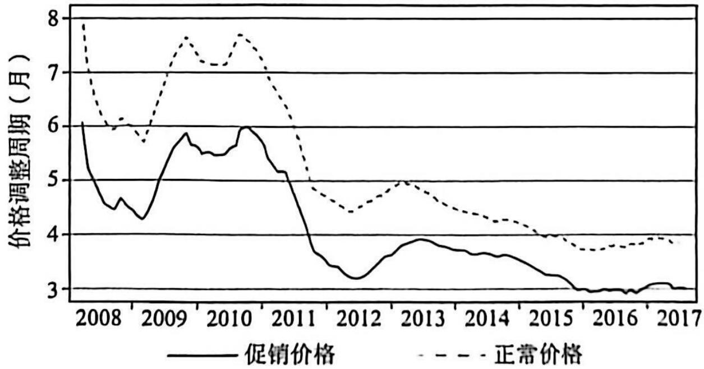
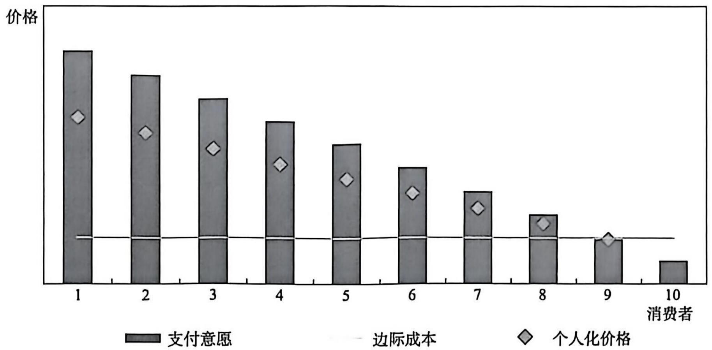
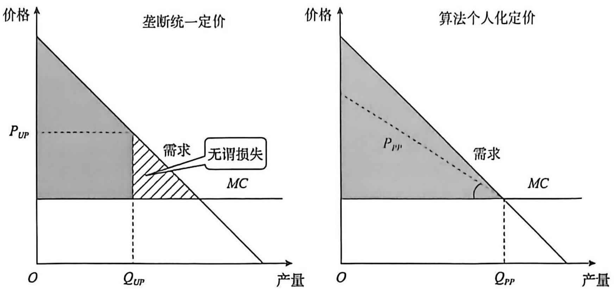

# 数字市场价格机制

# 章前导语

由于数字经济具有独特的运行规律，因此数字市场的商品或服务具有明显不同的定价机制，由此也引出了一系列有待研究的问题。首先，作为双边市场的数字平台需要重点关注价格结构问题，即如何对平台两侧用户分别定价的问题。其次，数字市场中很多商品或服务往往是免费向消费者提供的，存在大量的零价格现象。为什么数字市场会大量出现零价格现象呢？再次，随着大数据和人工智能技术的发展，在数字市场中，大量数字商务企业采用定价算法自动定价。这会对市场价格机制产生何种影响？如何认识寡头算法定价的价格合谋风险呢？最后，数字商务企业普遍利用大数据和人工智能算法来实现对单个消费者的精准营销，特别是实行个人化定价。那么对消费者而言，个人化定价是有害的吗？对上述问题的回答需要深入理解数字市场的定价机制。

# 学习目标

掌握双边平台不平衡价格结构的影响因素及具体形式；

掌握数字商品零价格的动机和企业盈利模式；

理解算法定价的影响及寡头市场算法价格合谋及反垄断监管政策；

理解算法个人化定价的实施条件、福利影响及反垄断监管政策。

# 7.1 双边平台价格结构

在数字经济中，由于数字平台是典型的双边市场，因此数字平台的定价不仅需要考虑总体价格水平，更重要的是要考虑价格结构。在多边平台中，价格结构是指平台对不同侧用户的收费水平或者收费比例。价格结构的设计科学与否在很大程度上决定了数字平台能否成功立足于市场并获得快速发展。

在单边市场，价格结构是平衡的，这主要是因为一侧用户价格的上涨会转嫁给另一侧用户，因此只有价格水平才能决定交易量和市场均衡的福利结果。而在价格水平不变的情况下，价格结构调整不影响交易量和市场均衡结果。在双边市场，价格结构是影响交易量的决定性因素，平台对单侧用户的定价不仅需要考虑服务成本和需求，更多的是需要考虑该侧用户对交叉网络效应的贡献，即其对另一侧用户的吸引力的大小。在交叉网络效应下，双边平台有可能对A侧用户免费或设定低于边际成本的价格，这会吸引更多的A侧用户。同时，由于A侧用户具有较强的交叉网络效应，更多的A侧用户又会吸引更多的B侧用户参与平台交易，从而扩大平台交易量并提高平台的收入。因此，双边平台在对一侧用户设定零价格或低于边际成本的价格的同时，对另一侧用户收取显著高于边际成本的价格的不平衡的价格结构成为平台实现交易量最大化和价值创造最大化的重要机制。价格结构成为多边平台最为重要的定价决策，不平衡的价格结构则是双边平台定价的基本方式。

# 7.1.1 双边平台不平衡的价格结构的影响因素

为了更好地说明双边平台不平衡的价格结构，我们这里介绍阿姆斯特朗（2006）提出的双边平台制定不平衡的价格结构的经典模型。阿姆斯特朗的基础模型假设平台两侧的用户群体分别为 A 和 B。平台对两侧用户交易收取的服务费分别为  $p_A$  和  $p_B$ ，两侧用户的需求分别为  $n_A(p_A, p_B)$  和  $n_B(p_B, p_A)$ ，需求弹性分别为  $\eta_A$  和  $\eta_B$  。假设平台向用户提供服务的单位可变成本为  $c_i$  。

假设平台两侧单个用户参与平台交易的效用函数分别为：

$$
u _ {A} = \alpha_ {A} n _ {B} - p _ {A}, u _ {B} = \alpha_ {B} n _ {A} - p _ {B} \tag {7-1}
$$

在公式（7-1）中， $\alpha$  是网络外部性参数，表示用户参与平台交易所获得的交叉网络效应的强度， $\alpha_{\Lambda} n_{B}$  和  $\alpha_{B} n_{\Lambda}$  分别表示一侧用户从另一侧用户数量中获得的效用。

假设平台的利润函数为：

$$
\pi \left(u _ {A}, u _ {B}\right) = n _ {A} \left(p _ {A} - c _ {A}\right) + n _ {B} \left(p _ {B} - c _ {B}\right) \tag {7-2}
$$

假设每侧用户的总效用为  $V(u)$  ，社会总福利函数为：

$$
W = \pi \left(u _ {A}, u _ {B}\right) + V _ {A} \left(u _ {A}\right) + V _ {B} \left(u _ {B}\right) \tag {7-3}
$$

根据公式（7-1）和（7-2），我们可以求得社会总福利最大化下平台对两侧用户的定价分别为：

$$
p _ {A} = c _ {A} - \alpha_ {B} n _ {B}, p _ {B} = c _ {B} - \alpha_ {A} n _ {A} \tag {7-4}
$$

公式（7-4）表明，在社会福利最大化条件下，平台对单侧用户的定价主要受两个因素的影响：一是服务边际成本。服务边际成本的增加会提高平台对单侧用户的定价。二是单侧用户对交叉网络效应的贡献（即A侧用户对B侧用户产生的交叉网络效应）。单侧用户对交叉网络效应的贡献增大会降低平台对其的定价。因此，在社会总福利最大化条件下，平台最优定价是每侧用户的服务边际成本减去其对交叉网络效应的贡献。因此，与单边市场的最优定价条件不同，双边市场的平台利润最大化定价条件不再是价格等于边际成本，而是背离了边际成本定价原则。对数字平台来说，其对用户的服务边际成本是相对较低的，因此交叉网络效应成为决定平台最优价格结构的主要因素。

根据公式（7-1）和（7-2）可得，垄断平台在利润最大化条件下对两侧用户的定价分别为：

$$
\frac {p _ {A} - \left(c _ {A} - \alpha_ {B} n _ {B}\right)}{p _ {A}} = \frac {1}{\eta_ {A}}, \frac {p _ {B} - \left(c _ {B} - \alpha_ {A} n _ {A}\right)}{p _ {B}} = \frac {1}{\eta_ {B}} \tag {7-5}
$$

公式（7-5）说明，垄断平台利润最大化定价仍遵循逆弹性定价法则，即在交叉网络效应和服务边际成本给定的情况下，平台对价格弹性较大的一侧用户收取相对较低的价格，对价格弹性较小的一侧用户收取相对较高的价格。

对公式（7-5）进行整理，垄断平台在利润最大化条件下对两侧用户的定价可以重新表述为：

$$
p _ {A} = \left(c _ {A} - \alpha_ {B} n _ {B}\right) + \frac {p _ {\Lambda}}{\eta_ {A}}, p _ {B} = \left(c _ {B} - \alpha_ {\Lambda} n _ {\Lambda}\right) + \frac {p _ {B}}{\eta_ {B}} \tag {7-6}
$$

假设  $\mu_{i} = p_{i} / \eta_{i}, i = A, B$  ，对上式进行进一步简化可得出，为实现垄断利润最大化，平台对单侧用户的定价公式为：

$$
p _ {i} = c _ {i} - \alpha_ {j} n _ {j} + \mu_ {i} \tag {7-7}
$$

公式（7-7）中的  $\mu_{i}$  具有与勒纳指数相同的含义，反映的是平台的市场势力的大小。公式（7-7）的结果说明，垄断平台在利润最大化条件下对单侧用户的定价取决于三个因素：平台的服务边际成本、单侧用户对交叉网络效应的贡献和平台的市场势力。

首先，在平台的服务边际成本和市场势力给定的情况下，追求利润最大化的垄断平台向单侧用户收取的价格与该侧用户对交叉网络效应的贡献负相关，即该侧用户对交叉网络效应的贡献越大，则平台向该侧用户收取的价格就越低，反之，则收取的价格就越高。这个结果可以很好地解释为什么淘宝等电商平台对消费者免费而向商家收费，搜索引擎、社交媒体等广告支持平台对消费者免费而向广告商收费，以及在线交友平台对女性免费而向男性收费。

其次，在平台的服务边际成本和单侧用户对交叉网络效应的贡献给定的情况下，平台的市场势力越大，则平台向用户收取的价格也相对越高。公式（7-7）显示，平台对单侧用户的定价仍遵循逆弹性定价法则。对公式（7-4）的社会福利最大化结果和公式（7-7）的垄断平台利润最大化结果进行比较可以发现，垄断平台利润最大化的价格结构与社会福利最大化的价格结构并不完全相同。追求垄断利润最大化的平台对单侧用户的定

价除受平台的服务边际成本和该侧用户对交叉网络效应的贡献的影响外，还受到平台的市场势力的影响，即平台的市场势力会使其定价结构扭曲，平台对单侧用户的市场势力越大，则其对该侧用户收取的价格就越高。

数字平台不平衡的价格结构，使传统单边市场的一些定价理论不再适用于双边市场。传统单边市场的定价理论主要有以下几个：一是企业基于成本定价，凡是严重背离成本的定价就是非法的垄断定价或掠夺性定价；二是市场竞争一定会降低价格，使消费者成本降低；三是在企业垄断的情况下，政府干预价格或价格结构会提升消费者福利或社会总福利。因此，不能将传统单边市场的定价理论运用到多边市场，尤其不能将单侧用户支付价格的高低作为合法与否的判定依据，而要从两侧用户价格结构的角度来分析单侧用户的付费是否合理。

# 7.1.2 双边平台不平衡的价格结构的具体形式

在商业实践中，双边平台通过区分不同侧用户的需求价格弹性设定不平衡的价格结构，常见的不平衡的价格结构形式有：

# （1）用户免费一广告商付费。

搜索引擎平台，如百度、谷歌和必应等，其主要功能是连接用户和广告商，使其实现互动。它们采用的不平衡的价格结构形式是用户免费一广告商付费。搜索引擎平台采用竞价排名方式，通常将愿意支付更高价格的广告商的广告安排在网站首页或搜索结果的前列。网易、新浪、搜狐等门户网站平台通常也采用用户免费一广告商付费的价格结构形式。

# (2）消费者免费一商家付费。

在淘宝、京东、亚马逊、eBay 等线上购物平台上，消费者可以免费浏览商家发布的商品信息，但当消费者和商家达成交易时，平台会向商家收取一定比例的交易佣金。同时，随着平台用户数量的增加和平台拥挤程度的上升，平台也会采用竞价排名等方式。例如，天猫商城推出了“直通车”推广活动，商家如果付费加入“直通车”推广活动，其店铺的商品就会有更大的曝光量，而且更加精准的搜索匹配结果也会给商品带来精准的潜在买家。

# (3）一侧用户免费—另一侧用户收费。

在百合网和世纪佳缘等在线交友平台上，平台针对女性用户的收费标准通常要比针对男性用户的收费标准低，且女性用户能够免费查看的男性用户信息的数量要比男性用户能够免费查看的女性用户信息的数量多很多。这是因为女性会产生更为显著的交叉网络效，因此平台通过免费或低价吸引更多的女性用户，进而吸引更多的男性用户并从对男性用户的高收费中获利。

# 7.1.3 不平衡的价格结构是否有害

总体来说，数字平台不平衡的价格结构是一种促进数字平台发展和提高社会总福利的定价机制。对两侧用户实行不平衡的价格结构是数字平台最主要的定价方式。其具体做法是：平台对一侧用户免费，而向另一侧用户收费，通过不平衡的价格结构吸引用户并弥补服务成本。在消费者免费或支付低价格而商家付费的不平衡的价格结构下，市场交易并不

会出现“一方受益而另一方受损”的零和博弈结果，而会由于交叉网络效应的存在，吸引广告商选择该平台。不平衡的价格结构基于平台两侧用户之间的交叉网络效应的正反馈机制提高了社会福利。因此，不平衡的价格结构可以同时提高生产者剩余和消费者剩余，并且生产者剩余的提高并不是以占有消费者剩余为代价的。但在特定情况下，不平衡的价格结构也可能成为一种支配企业的剥削性滥用行为。

数字平台对不同侧用户收费不同这种不平衡的价格结构是否违反反垄断法，是数字平台反垄断方面尚未解决的政策难题。在不平衡的价格结构下，付费较多一侧的用户往往会以高收费侵害了自身的利益为由要求反垄断机关对这种不合理行为进行干预，以维护自身的利益。那么反垄断机关应如何区分合法的不平衡的价格结构和非法的不平衡的价格结构呢？

例如，2020年疫情爆发期间，美团仍对餐饮商家征收占交易额  $20\%$  左右的交易佣金，这引发了广东餐饮协会与美团的争端。2020年10月，美国国会司法委员会在针对四大数字经济高科技巨头的反垄断调查报告中指控，苹果公司利用应用商店的市场支配地位向付费下载App的开发者收取  $30\%$  的高佣金，亚马逊公司对平台商家实行不公平交易条款并收取超过竞争水平的佣金。这些案例引发的问题是：数字平台对一侧用户收费高、对另一侧用户收费低的不平衡的价格结构在何种情况下可能会构成一种非法的滥用行为？

我国于2021年发布的《国务院反垄断委员会关于平台经济领域的反垄断指南》第十二条针对不公平价格行为做出了规定，指出分析不公平价格行为可以归纳为两种方法：一是可比较的方法，即价格是否明显高于可比较平台或可比较市场中的价格；二是价格是否明显偏离正常的成本变动或价格变动。这些因素显然不适用于具有双边市场属性的数字平台，原因包括：首先，数字平台市场往往具有典型的“赢家通吃”的市场结构，很难找到合适的可比较标准。其次，正如本节所指出的，影响平台定价水平的因素包括平台的服

务边际成本、单侧用户对交叉网络效应的贡献、平台的市场势力。判定不平衡的价格结构是不是一种不公平行为必须综合考虑这三个因素的影响，即判定重点是价格结构是否合理地反映了双边市场的经济合理性。对此，目前的经济学界尚没有提出一种可行的、简便的判定方法。

# 7.2 数字商品零价格

# 7.2.1 数字商品市场的零价格现象

商品零价格或免费是数字商品市场的一个常见现象，典型的如消费者在使用百度、谷歌等搜索引擎，微信、微博、推特等社交媒体，谷歌地图、高德地图、百度地图等在线地图，抖音、小红书等数字内容平台，以及大众点评等应用软件的时候，都不用付费，即平台向消费者收取的价格是零。在传统的经济学教科书中，经常出现的一句话是“天下没有免费的午餐”，即市场中不会存在免费的商品。那么，数字商品市场为什么会出现零价格现象呢？在数字市场中，数字平台实行零价格主要是出于以下几个原因：

# (1) 零边际成本下的定价。

数字商品往往是以软件的形式存在的，数字商品的生产往往具有高固定成本和近乎为零的边际成本。在给定固定成本的情况下，平台企业只要能迅速增加用户数量，就可以实现近乎为零的边际成本。零边际成本为企业向消费者提供免费商品或服务奠定了基础，从而使零价格成为一种可能。显然，数字经济发展所带来的零边际成本及其基础上的零价格会显著提升消费者福利。当然，企业为了补偿固定成本，在通过零价格实现用户规模扩大后，可以通过增值服务等方式来获得利润，即实现用户基础或用户流量的变现。

# (2) 质量价格歧视定价。

对多产品企业来说，免费商品是一种质量价格歧视定价方式。垄断企业仅对高需求弹性用户免费，而对低需求弹性用户收费。典型的如QQ音乐对大多数用户免费，但是对想要享受更高品质歌曲的用户收费。PDF reader、Adobe、Mathtype等软件的生产企业也都采用相似的三级价格歧视定价策略，对基础版免费，但是对功能完备的升级版收费。零价格还是一种捆绑定价的方式。由于互补品只有合在一起才能为消费者带来价值，因此企业对互补品中的一个产品免费，但是对另一个产品收费。此时，企业实行价格歧视定价可以获得比实行统一定价高的利润。

# (3) 扩大用户基础的短期促销行为。

由于数字经济具有非常强的网络效应，因此数字平台要顺利开展经营活动，就必须突破用户基础门槛要求，即平台只有吸引到足够多的用户，才能形成两侧用户相互吸引的正反馈机制。据此，在数字商品市场中，免费乃至负价格往往是平台企业在发展初期为了迅速吸引足够规模的用户，达到必要的用户基础规模，而采取的一种短期的市场策略。典型的如网约车业务刚刚在中国兴起时，滴滴就实施了“你打车我买单”的促销策略，支付宝在推广阶段采取了发红包策略等。在特定情况下，免费甚至可以被称为一种在位企业实施掠夺行为的方式，即通过免费来排斥竞争对手。当然，新进入市场的企业也可以通过零价格来抢占在位企业的市场份额，从而迅速进入市场。

# (4) 双边平台不平衡的价格结构。

向消费者用户提供免费商品或服务并不是平台企业的一种利他行为，而是一种利润最大化的决策行为。在以双边市场为主的平台商业模式中，平台两侧用户之间往往具有非常强的交叉网络效应，此时平台对消费者免费会吸引更多的消费者，从而吸引更多的广告商，然后通过向广告商收费来交叉补贴向消费者提供免费服务的成本并获得利润。在这种情况下，向一侧用户免费提供服务的成本实际是由另一侧用户承担的，对平台来说，这是为最大化交叉网络效应所采取的不平衡的价格结构或者是两侧用户之间的一种交叉补贴机制。

# (5) 利他主义行为。

在数字市场中，会出现非常多的利他主义行为。例如，在软件开发过程中，以Linux为代表的开源软件建立了开源社区，完全公开软件代码，以鼓励社区集体进行软件开发，维基百科、社会科学研究网（Social Science Research Network，SSRN）等都免费向消费者提供知识服务，一些知识传播平台也免费向用户开放。

# 7.2.2 零价格下的企业盈利模式

数字商品和服务交易的一个重要特征是消费者往往以零价格获取它们。由于数字商品或服务具有零边际成本和商品同质化特征，因此数字商品市场的竞争往往会产生完全竞争市场的结果，即企业的定价为  $P = MC = 0$  ，消费者享受的是零价格的数字商品和服务。在传统经济学理论中，在零价格的情况下，市场的运行将面临巨大的问题，因为这将使商家无法通过收入弥补成本并盈利，从而无法形成市场。因此，在零价格的数字商品或服务市场中，所有企业面临的一个基本问题就是如何实现盈利。

在数字经济中，平台企业的盈利主要有以下几种实现途径：

一是向商家或消费者收费。例如，电子商务、在线旅游预订、滴滴等平台向商家收取单笔交易额的一定比例作为佣金；在线音乐平台等向消费者收取注册费或会员费。

二是向广告商收取广告费。典型的如搜索引擎、社交媒体等平台通常向广告商收费并对消费者免费，如脸书对消费者免费，其总收入中的  $90\%$  来自向广告商收取的广告费。

三是向高需求消费者收费。企业对消费一般商品或基础版商品的消费者免费，但是对消费差别化商品或升级版商品的消费者收费。

四是依靠用户或第三方捐款来获得收入以维持运营。例如，SSRN 是一个免费开放的社会科学领域学术论文在线数据库，平台通过公开募捐来获得运营经费。

综上，在大多数情况下，向消费者提供免费商品或服务并不是数字平台企业的一种利他主义行为，而仍然是一种利润最大化决策行为。

# 7.2.3 零价格的福利影响

在大多数情况下，数字经济市场的零价格会显著提高消费者福利，并促进企业之间的质量竞争，如Linux等开源软件对所有人开放源代码会极大地促进技术创新。但在消费者支付零价格的情况下，消费者的福利也可能会受损。在一些情况下，零价格可能会对消费者福利产生负面影响，主要体现为以下几种风险：

一是低质量供应风险。消费者消费的免费商品往往是低质量的商品或服务，有时这种低质量的商品或服务并不会提高消费者福利。例如，在新闻网站、在线视频等平台，尽管消费者可以免费观看数字内容，但是过多的插入广告实际上对消费者产生了负效用，导致消费者消费的是低质量商品。

二是剥削性定价或掠夺性定价风险。在具有市场支配地位的数字平台实行不平衡的价格结构的情况下，平台尽管对消费者免费，但是为了获取垄断利润，可能会向平台另一侧用户收取过高的价格，从而构成反垄断法所禁止的非法“过高定价”。零价格也可能会成为一种掠夺性定价方式。当零价格成为在位支配平台企业排斥竞争对手的一种掠夺性定价行为时，尽管消费者在短期内获得了好处，但是，一旦支配平台企业获得了稳固的市场垄断地位，其就会制定较高的价格，从而损害消费者的长期福利。在在位平台企业对商品或服务免费的情况下，通过创新进入市场的竞争者要获得用户基础，就必须免费提供商品或服务，这会使新进入的竞争者无利可图，从而产生市场封锁效应。

三是个人隐私被侵犯的风险。在零价格情况下，如果数字平台通过过度采集消费者个人数据并向广告商收费来获利，则此时会存在较大的消费者个人隐私受侵犯的风险。在数字经济中，消费者福利不再仅仅取决于其购买商品所支付的价格，还取决于个人隐私数据的受保护程度。过度采集和使用个人隐私数据会严重损害消费者福利。因此，需要完善个人隐私数据保护制度，赋予消费者合理的个人隐私数据权益，规范企业的数据采集和利用行为，以保护消费者的个人隐私不被侵犯。

# 7.2.4 零价格与消费者数据

在很多情况下，数字经济中的零价格并不是真正意义上的免费。因为消费者在消费免费商品或服务时，实际上付出了可以货币化的个人数据信息和具有一定成本的个人注意力。市场经济的本质是交易经济。在零价格商品和服务的交易中，尽管消费者支付的是零价格，但是消费者也付出了成本，即个人数据和个人注意力等。只不过由于个人数据市场缺乏交易机制，因此消费者支付的个人数据无法通过价格反映出来。

在数字经济中，消费者免费通常是指消费者不需要支付明显的费用，但这并不意味着消费者在消费商品或服务时不需要付出。由于数据成为数字经济中最重要且最有价值的资源之一，因此消费者在搜索引擎、社交媒体等平台上享受免费商品的同时，实际上也付出了关于其位置、偏好、人际关系和个人习惯等方面的个人数据，很多时候消费者甚至是在完全不知情的情况下向数字商务企业提供多维度的个人数据信息的。在某些情况下，如果消费者不提供个人数据，那么其就无法使用有关的商品或服务。在搜索引擎、社交媒体等广告支持的多边平台市场，消费者免费使用平台服务的同时也免费向平台提供了用户数据，这些数据是平台提升广告价值和开发新的服务的重要基础。平台通过对用户大数据的收集和利用设计出更个性化的服务和广告，从而增加收入和竞争力。

数据是数字经济中最有价值的要素投入。从某种意义上来说，在数字市场商品或服务免费的情况下，消费者提供的个人数据是一种隐性货币。例如，美国电信企业AT&T为使用户同意采集和使用其个人数据，而给予同意的消费者每月29美元的网络宽带费折扣，亚马逊也给予同意接受其目标广告的电子书读者一定的价格折扣。在一定程度上，个人数据可以被看作对免费使用商品或服务的一种货币补偿；否则，为了征得消费者同意，数字平台在采集利用消费者的个人数据时就需要向消费者付费。免费商品和免费采集数据的结合实际上省去了价格交易的过程。但是，如果企业未经消费者授权就擅自采集消费者个人数据，那么这种强迫消费者接受不合理的隐私条款或者过度采集利用消费者数据的行为就会构成对消费者个人隐私的侵犯。

# 7.3 算法定价与合谋

# 7.3.1 算法定价

随着在线交易电子商务的快速发展，越来越多的在线交易电子商务企业采用人工智能算法进行动态的自动定价。典型的如作为一个大型在线交易电子商务平台的亚马逊采用了

大量的动态自动定价算法。亚马逊向其平台上的第三方卖家提供动态和自动的低价匹配算法，这种算法能帮助平台卖家及时匹配来自竞争对手的相同或相似商品的最低销售价格，从而使平台卖家在亚马逊上的商品在一天之内能根据竞争对手的定价进行多次调整。同时，亚马逊还利用算法来实施各种价格歧视定价，如亚马逊对Prime会员收取比非Prime会员更高的价格，对选择“免费单日送货”的客户提高价格，以及根据一天中各时间段的客户流量自动调整价格。

算法定价是企业基于大数据，采用人工智能算法对待售商品自动定价，从而实现利润最大化目标的定价方法。算法定价主要分为三类：一是基于竞争对手的动态定价。算法通过自动决策来动态地调整价格，以对竞争对手的定价做出反应。欧盟委员会（2017）的调查显示，大部分电子商务零售商都通过算法来追踪竞争对手的定价，其中三分之二的电子商务零售商采用自动定价的软件程序，基于竞争对手的定价来制定自己的商品或服务的价格。①二是针对个人的个人化定价。基于采集的消费者在线行为数据，算法能够相对准确地推测出消费者的消费偏好、支付意愿（即愿意支付的价格）或价格敏感度，然后针对每个消费者设计个人化的价格或折扣。三是针对多产品的差异化定价。人工智能算法能根据不同产品对消费者价值感知的影响、与其他产品的相似性以及其他因素，来优化不同产品和相同产品不同类别的定价，制定最优的多产品价格结构。

在线上市场中，不仅大型电商平台实行算法定价，而且平台卖家也采用由专业公司开发的定价算法来进行算法定价。定价算法的大量应用导致市场中的价格调整频率大幅上升，从而显著提高了市场价格的波动性。例如，2013年11月，亚马逊每天平均进行了250多万次价格调整。经济学家卡瓦洛（Cavallo，2018）对美国亚马逊线上市场价格数据进行分析后发现，定价算法的应用使正常价格调整周期由2008—2010年的平均6.7个月缩短到2014—2017年的平均3.6个月，促销价格调整周期由2008年的平均5个月下降为2017年的平均3个月（见图7-1）。从具体行业来看，价格调整频率最高的是在线零售市场，并且主要是家用电器和家居产品。②

  
图7-1 市场价格调整周期

算法定价的应用可以提高市场运行效率，更好地实现供需的动态平衡。在实行算法定价的情况下，价格对市场供求变化的反应更加灵敏，这加快了市场出清的速度。特别是对于食品、机票、酒店客房等容易被浪费的商品而言，应用算法定价可以根据市场供求变化及时调整价格，减少供求失衡现象的发生。

在企业普遍应用算法定价的情况下，市场中的产品价格体现出显著的趋同性。同一商品在不同平台之间、线下和线上之间、不同在线卖家之间的价格差别显著缩小，并且市场价格呈现出明显的趋同化特征。线上市场商品价格的趋同说明，算法定价消除了消费者搜寻成本所带来的价格离散问题。

但是，在特定的寡头市场结构下，应用算法定价的企业能够根据竞争对手的价格变动及时地跟进调整，可能会产生价格合谋问题，从而扭曲市场竞争和损害消费者福利。同时，算法定价也可能成为一种支配企业剥削性定价的方式，会导致企业更多地占有消费者剩余，从而损害消费者福利。因此，在大规模应用定价算法时，既要看到其促进竞争和提高消费者福利的积极作用，也要注意其损害竞争和消费者福利的消极作用。

  
知识链接  
亚马逊的  
“尼斯湖水怪计划”

# 7.3.2 寡头市场算法价格合谋

算法价格合谋（简称算法合谋）是指寡头企业通过算法定价来实现及时、有效的价格协调和价格监督，从而导致市场出现垄断定价或统一定价的结果的行为。在寡头企业实行算法合谋的情况下，参与算法合谋的企业几乎可以立即观察到所有竞争对手的价格，从而及时发现任何单个企业偏离合谋统一定价的行为，并根据偏离算法合谋定价企业的定价来迅速、及时地调整自己的价格，使单个企业偷偷降价不仅无利可图，而且可能会引起所有参与企业实施低价格。因此，算法定价可能会促使企业合谋，导致消费者不得不支付高价格。

算法合谋分为四种类型：信使算法合谋、轴辐协议算法合谋、预测代理人算法合谋和自我学习算法合谋。

# (1) 信使算法合谋。

信使算法合谋是寡头企业有意识地采用算法作为实现价格合谋的工具的算法合谋。此时，算法主要是发挥收集竞争对手价格信息或分享彼此信息的中介作用，避免了依靠人力收集信息和沟通信息的局限，其为寡头企业实施已有合谋协议提供了一种有效的方式。在2015年美国司法部查处的Davidtopkins合谋案中，司法部发现以DavidTopkins为首的商家在亚马逊平台的销售中采用专门的算法定价来收集竞争对手的价格信息，并据此协调彼此的定价，以实现合谋，因此美国司法部认定其定价行为构成非法的价格合谋，并对其处以2万美元的罚款。

# (2) 轴辐协议算法合谋。

轴辐协议算法合谋是指寡头企业共同采用由同一个第三方开发的算法，或者这些企业都通过同一个采用算法定价的平台进行定价并交易的算法合谋。在2015年美国Uber公司案中，美国法院指控Uber公司与每个网约车司机签订纵向协议并要求每个网约车司机都采用相同的算法，这样就实现了非法的价格合谋。在2016年欧盟的E-Turns案中，作为在

线预订系统开发者的 E-Turas 向在平台交易的各旅行社发了一封电子邮件，宣布对各个旅行社给予顾客的价格折扣率制定一个基于算法技术的上限。欧盟法院指出，这些旅行社知道这会导致其参与卡特尔，因此该行为构成了非法的价格合谋。

# (3) 预测代理人算法合谋。

预测代理人算法合谋是指每个寡头企业都单独采用利润最大化的算法定价来提高市场透明度和对竞争对手行为的预测能力的算法合谋。此时算法扮演了观察竞争对手行为的监督者角色，它能监督

竞争对手的价格、产量的变化，并根据变化及时采取应对策略，包括实施相应的惩罚措施等，这会便利企业之间达成和维持合谋协议。在此情况下，每个寡头企业采用定价算法的动机都是实现价格合谋，只不过企业之间并不直接进行协调或沟通，而是通过算法来协调或沟通。因此，此时的价格合谋是一种“有意识的平行行为”。

# (4) 自我学习算法合谋。

在自我学习算法合谋的情况下，每个企业都采取利润最大化的算法定价。此种算法定价基于自我学习技术，根据利润最大化目标，实时采集和处理竞争对手的价格数据并自动调整自己的定价，以对竞争对手的定价做出反应，从而导致合谋结果的出现。此时的合谋完全是人工智能算法自己完成的，并不是人为设计或干预的结果，企业之间并没有建立人为的沟通协调机制，即每个企业采用自我学习算法的个体决策导致了集体合谋的结果。由于自我学习算法合谋是企业之间没有人为干预的结果，因此其对传统的反垄断政策提出了挑战。

# 7.3.3 算法价格合谋的反垄断监管政策

价格合谋会对市场竞争和消费者福利产生严重的损害，因此价格合谋是各国反垄断法严格禁止的垄断行为。鉴于算法定价的广泛应用带来了较高的企业价格合谋风险，增强了算法价格合谋的隐蔽性，因此目前各国的反垄断机构都在寻求更为有效的反垄断政策，其中强化反垄断事前监管成为重要的政策探索。

反垄断事前监管的目的是通过事前监管防患于未然，避免事后执法的低效能。目前已经提出的政策建议包括：一是强调算法设计要遵循竞争中立原则，即企业在设计算法时，就要将避免出现价格合谋作为重要的考虑因素，通过算法设计来避免合谋结果的出现。二是执法机构可以强制延长定价算法对市场条件做出反应的时滞，或冻结一个供应商（即价格最低的供应商）的价格，这将激励其他供应商设置低于该公司价格的价格，以获取额外的产能。三是进行算法审计，如审查治理文件、测试算法输出或检查其内部运作等，以此来检测算法是否会导致合谋结果。四是激励消费者使用算法，以破坏寡头企业的算法合谋计划。由于目前算法合谋的案件并不是很多，加之上述政策建议的具体影响还不是非常清楚，因此还需要进一步研究才能做出政策选择。

  
知识链接  
欧洲汽车企业对零部件实行算法定价

# 7.4 算法个人化定价

# 7.4.1 个人化定价及其实施条件

随着大数据和算法技术的发展，数字平台普遍大量采集关于消费者个人特征与交易行为的数据，并据此为消费者制定个人化价格。2018年德勤咨询公司开展的一项涉及500多个公司的调查发现，在所有采用人工智能实现个性化营销的零售商中，有  $40\%$  的零售商采用人工智能实行个人化定价和个性化营销。

算法个人化定价主要是指数字商务企业利用大数据和算法对消费者的购买行为数据进行分析并精确识别消费者的支付意愿，从而针对每个消费者制定不同价格的定价方式。由于个人化定价主要依靠对消费者的数据分析，因此个人化定价有时也被称为“大数据价格歧视”或“大数据杀熟”。

传统意义上的价格歧视分为三种类型：一级价格歧视、二级价格歧视和三级价格歧视。算法个人化定价是价格歧视中的一种特定形式，其更接近于一级价格歧视或完全价格歧视，属于企业与消费者一对一的关系；在某些情况下，如果企业掌握的数据有限，则可能会依据消费者的群体类型对每个消费者定价，此时的个人化定价更接近按群体划分的三级价格歧视，是一种不完全的个人化定价。

根据价格歧视理论，一个企业实行个人化定价必须满足以下三个条件：一是企业必须具有一定程度的市场势力。如果市场是完全竞争市场，那么一价定律就成立，因为竞争会使每个消费者支付的价格等于边际成本。二是企业必须拥有充分的信息以识别消费者的异质性，并根据每个消费者的支付意愿来制定个人化价格。三是企业必须能够防止套利行为的发生。也就是说，要让消费者不能轻易地以较低的额外成本套利，即在一个市场以低价购买，而在另一个市场以高价卖出，否则这种转售商品的套利行为将导致商品的市场价格趋于统一。

垄断企业实行一级价格歧视（也称完全价格歧视）的主要障碍是需要掌握完全的消费者信息，即对每个消费者的支付意愿完全了解，并据此制定等于每个消费者的支付意愿的价格，从而占有全部消费者剩余。长期以来，在现实市场中，由于企业无法掌握完全的消费者信息，因此其无法实行完全价格歧视。在多数情况下，一级价格歧视仅仅是一种理论分析。在现实中，如果垄断企业无法获得每个消费者的个人数据信息，则其只能实行垄断统一定价，消费者则获得信息租金，但这会导致社会总福利较低。如果垄断企业拥有可以将消费者分为不同群体的信息，尤其是掌握了不同消费者群体的差别化支付意愿，则其可以实行三级价格歧视。大数据和人工智能技术的发展消除了企业实行一级价格歧视所面临的信息约束，使企业可以采集大量关于单个消费者的在线行为数据，通过对个人数据的挖掘分析预测消费者的支付意愿，据此制定接近或等于单个消费者保留价值的个人化价格。因此，在算法个人化定价的情况下，企业向每个消费者收取等于其支付意愿的价格（如图7-2所示）。

在现实中，数字商务企业往往无法实行占有全部消费者剩余的完全价格歧视。这主要有以下两个原因：一是受到数据质量和算法质量的限制，企业并不能完全判断出消费者的

支付意愿，此时贸然制定等于消费者的支付意愿的价格可能会导致消费者退出市场。因此，企业制定的个人化价格往往比实施完全价格歧视时制定的价格水平低。二是现实中由单个企业垄断的市场很少。当市场存在一定程度的竞争时，市场竞争会限制企业向消费者收取等于其支付意愿的价格。只有当企业是独家垄断企业并且拥有完全的消费者数据收集利用能力时，个人化定价才会导致完全占有消费者剩余的完全价格歧视。此时，垄断企业实施的近乎完全价格歧视的高定价会造成对消费者福利的严重损害。

  
图7-2 具有不同支付意愿的消费者支付的价格

# 7.4.2 算法个人化定价对福利的影响

判断算法个人化定价对福利的影响的参照标准不应是完全竞争市场中的消费者福利，而应是企业实行统一定价的福利。因此，对于一个垄断企业来说，其既可以实行垄断统一定价，也可以实行算法个人化定价。

在算法个人化定价的情况下，垄断企业对高支付意愿的消费者制定高价格，对低支付意愿的消费者制定低价格。相对于垄断统一定价来说，尽管个人化定价提高了对高支付意愿的消费者制定的价格，但同时可以使在统一定价下被驱逐出市场的低支付意愿的消费者能够以较低的价格消费。由于消费者群体中有人受益，有人受损，因此对于社会总体来说，个人化定价对福利的影响是不确定的。

从社会总福利的角度来说，相对于垄断统一定价，个人化定价通常可以提高社会总福利。在图7-3中，垄断统一定价会导致低支付意愿的消费者退出市场，从而导致社会福利无谓损失；在个人化定价的情况下，所有消费者都在市场消费，因此不会导致社会福利无谓损失。因此，在大多数情况下，算法个人化定价提高了社会总福利。

虽然算法个人化定价有可能提高社会总福利，但算法个人化定价会引起效率和公平之间的冲突，因为它会使一部分人的状况变好，而使另一部分人的状况变差。首先，高支付意愿和低支付意愿的消费者之间存在不公平。个人化定价有可能造成总消费者剩余从高支付意愿的消费者向低支付意愿的消费者转移，即存在内部群体间交叉补贴问题。其次，消

  
图7-3 垄断统一定价与算法个人化定价的福利

费者剩余完全被生产者占有。在个人化定价的情况下，消费者剩余全部变成垄断企业的利润，这会引起消费者和生产者之间的利益冲突。因此，当执法机构按照社会总福利标准判断算法个人化定价对福利的影响时，算法个人化定价通常不会构成违法；但是当执法机构按照消费者福利最大化标准判断算法个人化定价的福利影响，并且尤其关注消费者公平问题时，则算法个人化定价有较大可能会构成违法并被禁止。

# 7.4.3 算法个人化定价反垄断监管政策

由于算法个人化定价会导致高支付意愿的消费者支付高价格、低支付意愿的消费者支付低价格，因此在算法个人化定价下，支付高价格的消费者会强烈反对，并呼吁政府进行干预。从国际经验来看，主要是适用反垄断法对算法个人化定价进行监管，而不是“一刀切”地加以禁止。2020年11月，中国发布的《国务院反垄断委员会关于平台经济领域的反垄断指南》第17条表明，具有市场支配地位的平台企业不应基于大数据和算法，根据交易相对人的支付能力、消费偏好、使用习惯等，实行差别待遇。由于算法个人化定价往往具有效率效应和反竞争效应，以及独特性，因此反垄断部门如何判断其是否违法，如何采取更有效的反垄断监管政策就成为需要解决的问题。

在中国，不仅可以根据《反垄断法》监管算法个人化定价行为，一些相关的法律也对个人化定价做出了规定。例如，《个人信息保护法》第24条明确规定，个人信息处理者利用个人信息进行自动化决策，应当保证决策的透明度和结果公平、公正，不得对个人在交易价格等交易条件上实行不合理的差别待遇。同时，《价格法》第14条明确禁止相互串通、操纵市场价格、损害其他经营者或消费者的合法权益等价格歧视行为。《互联网信息服务算法推荐管理规定》明确提出，算法推荐服务提供者不得利用算法对其他互联网信息服务提供者进行不合理限制，或者妨碍、破坏其合法提供的互联网信息服务的正常运行，实施垄断和不正当竞争行为。由于多部法律或规定都对算法个人化定价做出了禁止规定，因此如何避免采用“一刀切”的禁止政策，并增强法律之间的协同，成为迫切需要解决的问题。

由于算法个人化定价主要是基于对消费者个人数据的收集实现的，因此政府的隐私保护政策和消费者的数据保护行为会对算法个人化定价产生重要影响。首先，在严格的个人数据保护和监管下，如果消费者知道企业采集其个人数据后将对其制定个人化高价格，那么其必定会拒绝企业采集其个人数据。其次，消费者可能会采取相应的措施应对企业收集个人数据的行为。例如，消费者可以通过决定个人数据披露的程度，以及使用隐私保护软件、匿名技术或更换电脑/手机下单等措施来规避算法个人化定价。因此，消费者的应对会对企业的算法个人化定价决策产生重要的影响。

  
知识链接  
携程“大数据杀熟”案

# 本章小结

在数字经济中，价格结构是数字平台最为重要的决策。价格结构科学与否决定了平台能否吸引用户并做大交易量。数字平台对单侧用户的收费取决于三个因素：平台的服务边际成本、对交叉网络效应的贡献和平台的市场势力。在平台的服务边际成本和平台的市场势力给定的情况下，追求利润最大化的垄断平台对单侧用户的定价与该侧用户对交叉网络效应的贡献负相关，即该侧用户对交叉网络效应的贡献越大，则平台对该侧用户的定价就越低。数字平台对不同侧用户制定不同价格这种不平衡的价格结构是否构成对反垄断法的违反，是尚待解决的政策难题。

数字商品或服务市场中出现零价格现象主要有以下几种原因：零边际成本下的定价、质量价格歧视定价、扩大用户基础的短期促销行为、双边平台不平衡的价格结构、利他主义行为。在很多情况下，数字经济中的免费商品或服务并不是真正意义上免费提供的，数字平台企业往往会通过间接的方式获利。零价格既具有显著的效率提升效应，也可能会带来低质量供应风险、剥削性定价或掠夺性定价风险、个人隐私被侵犯的风险等。

数字企业大量使用算法定价可以提高市场运行效率，更好地实现供需的动态平衡。在企业普遍采用算法定价的情况下，市场中的产品价格呈现出显著的趋同性。在特定的寡头市场结构下，算法定价可能会导致价格合谋问题，从而扭曲市场竞争和损害消费者福利。算法合谋分为四种类型：信使算法合谋、轴辐协议算法合谋、预测代理人算法合谋和自我学习算法合谋。为了防止企业利用算法合谋，需要创新反垄断执法政策。

算法个人化定价主要是指数字商务企业利用大数据和算法技术对消费者的购买行为数据进行分析并精确识别消费者支付意愿，从而针对每个人制定不同的价格的定价方式。相对于垄断统一定价来说，算法个人化定价通常会提高社会总福利，但算法个人化定价会引起效率和公平之间的冲突。

# 主要概念

价格结构 零价格 算法定价 算法合谋 算法个人化定价 信使算法合谋 轴幅协议算法合谋 预测代理人算法合谋 自我学习算法合谋

# 《复习题》

1.双边平台设置不平衡的价格结构的原因有哪些？  
2. 数字商务企业实行零价格的动机是什么？其实现盈利的方式有哪些？  
3. 算法价格合谋有哪些具体的形式？它们之间有何区别？  
4. 算法个人化定价对消费者福利有什么影响？

# 推荐阅读文献

唐要家，尹钰峰.算法合谋的反垄断规制及工具创新研究.产经评论，2020（2）.

唐家. 平台不平衡价格结构的剥削性滥用效应. 经济与管理研究, 2021, 42 (3).

唐要家，郭鸿. 美团交易佣金率的经济性质及反垄断政策. 中国物价，2022（7）.

唐要家，傅樟洋. 平台佣金征收的影响因素及剥削性滥用分析. 东北财经大学学报，2022（3）.

唐要家. 三级价格歧视竞争效应与反垄断政策. 北京：经济科学出版社，2016.

CALVANO E, CALZOLOAI G, DENICOL V, et, al. "Artificial Intelligence, Algorithmic Pricing, and Collusion." American Economic Review, 2020, 110 (10).

HARRINGTON J E. “Developing Competition Law for Collusion by Autonomous Price-Setting Agents.” Journal of Competition Law and Economics, 2018, 14 (3).

GAL M, RUBINFELD D L. "The Hidden Costs of Free Goods: Implications for Anti-trust Enforcement." Antitrust Law Journal, 2016, 80 (401).